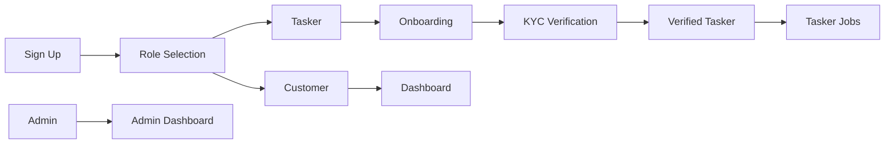

# SewaKhoj Architecture & Design Guide

This guide explains the key architectural patterns and design decisions implemented in the SewaKhoj platform to maintain a premium, bilingual experience.

---

## 🌍 Bilingual Design Pattern
To handle the English and Nepali requirements, we use a "Stacked Label" pattern rather than concatenation.

### Implementation Rule:
- **English Labels:** Usually `font-black text-gray-900` or `font-bold`.
- **Nepali Labels:** Usually `font-devanagari text-gray-400 font-bold uppercase tracking-widest` (for secondary) or `text-sewakhoj-red` (for emphasis).
- **Separation:** Always separate scripts by a line break or a vertical margin to avoid visual clutter on small screens.

**Example (JSX):**
```tsx
<div className="flex flex-col">
  <span className="text-sm font-black">Find a Pro</span>
  <span className="text-[10px] text-gray-400 font-bold">प्रो खोज्नुहोस्</span>
</div>
```

### Devanagari Typography
- Use the `.font-devanagari` CSS class for Nepali text blocks.
- CSS properties: `word-spacing: 0.05em` and `letter-spacing: 0.02em` for improved readability.
- Font family: Poppins (supports both Latin and Devanagari scripts).

---

## 🏗 Navigation Structure
The project follows a **Global Root Layout** pattern.

- **`src/app/layout.tsx`**: The ONLY place where `<Navbar />` and `<Footer />` should be defined.
- **Conditional Visibility**: Navigation is hidden on specific routes (Admin, Dashboard, Onboarding) using a `isPortalView` or `isTaskerView` check based on `usePathname`.
- **Z-Index Management**:
    - Navbar: `z-50`
    - Location Banner: `z-[45]`
    - PWA/WhatsApp Floating Buttons: `z-[60]`
    - Modals: `z-[100]`

### Route Structure
| Category | Routes |
|---|---|
| **Public** | `/`, `/browse`, `/blog`, `/faq`, `/terms`, `/contact`, `/signup`, `/forgot-password` |
| **Customer** | `/dashboard`, `/book/[taskerId]`, `/booking/[id]/tracking`, `/settings` |
| **Tasker** | `/tasker/onboard`, `/tasker/jobs`, `/tasker/verification`, `/tasker/welcome`, `/tasker/landing` |
| **Admin** | `/admin/*` (users, taskers, support, settings, finance, announcements) |

---

## 🔐 Authentication & Role-Based Access

### Auth Flow


### Implementation Details
- **Provider**: Supabase Auth (email/password + magic link)
- **Client Side**: [`AuthContext`](src/context/AuthContext.tsx) uses the singleton Supabase client from [`supabase-browser.ts`](src/lib/supabase-browser.ts) to listen to `onAuthStateChange`.
- **Server Side**: [`supabase-server.ts`](src/lib/supabase-server.ts) for middleware and server component auth checks.
- **Protected Routes**: Handled via `useEffect` checks in page components or `AuthContext` redirects.
- **Role Selection**: After signup, users are redirected to [`/role-selection`](src/app/role-selection/page.tsx) to choose Customer or Tasker.
- **Auth Callback**: [`src/app/auth/callback/route.ts`](src/app/auth/callback/route.ts) handles OAuth and magic link callbacks.

### Role Hierarchy
- **Customer** — browses, books, pays, reviews
- **Tasker** — verified via 3-tier KYC (ID, Background, Gear), receives jobs, gets paid
- **Admin** — full platform control via no-code admin dashboard

---

## 🗃️ State Management (React Context)

All global state is managed via React Context in [`src/context/`](src/context/):

| Context | File | Purpose |
|---|---|---|
| **AuthContext** | [`AuthContext.tsx`](src/context/AuthContext.tsx) | User session, profile data, role, sign-in/out |
| **LocationContext** | [`LocationContext.tsx`](src/context/LocationContext.tsx) | Current city, geolocation, coordinates |
| **NotificationContext** | [`NotificationContext.tsx`](src/context/NotificationContext.tsx) | Global toast/notification system |

### Pattern Rules
- Always wrap the app with all three providers in [`src/app/layout.tsx`](src/app/layout.tsx).
- Use custom hooks (`useAuth`, `useLocation`, `useNotifications`) exported from each context.
- Avoid prop drilling — if state is needed across 2+ component levels, it belongs in context.

---

## 🔍 Search & Discovery
- **`SearchAutocomplete.tsx`**: Supports a `minimal` prop for use inside high-density headers or hero sections.
- **Service Chips**: Link directly to `/browse?service=[slug]` to provide instant filtered results, reducing the friction of manual typing.
- **Search Keywords**: Static keyword data in [`src/data/search-keywords.ts`](src/data/search-keywords.ts) powers autocomplete suggestions.
- **Browse Filters**: [`BrowseFilters.tsx`](src/app/browse/BrowseFilters.tsx) handles service type, city, rating, and price range filtering.

---

## 📍 Location System
Location is treated as a top-priority input.

### Components
| Component | Purpose |
|---|---|
| [`LocationContext`](src/context/LocationContext.tsx) | Central location state management |
| [`LocationDetector`](src/components/LocationDetector.tsx) | Browser geolocation API integration |
| [`LocationModal`](src/components/LocationModal.tsx) | City selection modal |
| [`LocationSelector`](src/components/layout/LocationSelector.tsx) | Inline city picker |
| [`TaskerLocationSelector`](src/components/TaskerLocationSelector.tsx) | Tasker service area selection |
| [`TaskerLocationTracker`](src/components/TaskerLocationTracker.tsx) | Real-time tasker GPS tracking |

### Pattern
- On mobile, a sticky banner is used to ensure the current city is always visible and changeable.
- Reverse geocoding is proxied through [`/api/reverse-geocode`](src/app/api/reverse-geocode/route.ts) to bypass CORS/CSP restrictions.
- PostGIS extension enabled for proximity-based tasker search (migration `042_postgis_location.sql`).

---

## 🔌 API Architecture

Next.js Route Handlers in [`src/app/api/`](src/app/api/):

| Endpoint | Purpose |
|---|---|
| `/api/reverse-geocode` | Proxies Nominatim (OpenStreetMap) geocoding requests |
| `/api/push/send` | Triggers web push notifications |

### Supabase Edge Functions (Deno)
Located in [`supabase/functions/`](supabase/functions/):

| Function | Purpose |
|---|---|
| `esewa-status-check` | Verify eSewa payment status |
| `esewa-token-inquiry` | Lookup eSewa transaction tokens |
| `khalti-verify` | Verify Khalti payment callbacks |
| `send-push` | Server-side push notification dispatch |
| `approve-tasker` | Admin tasker approval workflow |

### Pattern Rules
- Route handlers are for lightweight proxying (CORS, CSP bypass).
- Edge Functions handle business logic requiring secure server-side execution (payment verification).
- Never expose service keys in client-side code — always proxy through server.

---

## 🗄️ Database & RLS Pattern

### Connection Flow
- **Client**: [`supabase-browser.ts`](src/lib/supabase-browser.ts) — singleton pattern to avoid auth loops.
- **Server**: [`supabase-server.ts`](src/lib/supabase-server.ts) — for server components and middleware.
- **Admin**: [`supabase.ts`](src/lib/supabase.ts) — service role client for privileged operations.

### Row Level Security (RLS)
- All tables are protected by RLS policies defined in migration files.
- Policies are role-aware (customer, tasker, admin).
- Master RLS hardening applied in migration `040_master_rls_hardening.sql`.

### Migration Convention
- Files in [`supabase/migrations/`](supabase/migrations/) follow numeric ordering (`000_`, `001_`, etc.).
- **NEVER modify existing migrations** — always create new migration files for schema changes.
- Each migration should be self-contained and idempotent where possible.

### Key Tables
| Table | Purpose |
|---|---|
| `profiles` | User profiles (linked to auth.users) |
| `taskers` | Tasker-specific data (skills, verification, pricing) |
| `job_posts` | Customer job listings for bidding |
| `bookings` | Confirmed service bookings |
| `payments` | Payment transaction records |
| `ledger` | Financial ledger (double-entry) |
| `notifications` | User notification inbox |
| `announcements` | Platform-wide announcements |
| `site_settings` | Dynamic platform configuration |
| `cities` | Serviceable cities with PostGIS coordinates |
| `favorites` | Customer bookmarked taskers |
| `referrals` | Referral tracking and rewards |
| `kyc_verifications` | Tasker identity/background/gear verification |
| `disputes` | Booking dispute resolution |
| `audit_logs` | System-wide activity logging |

---

## 💳 Payment Integration

### Supported Gateways
- **eSewa** — Nepal's leading digital wallet
- **Khalti** — Secondary digital wallet

### Flow
1. Customer initiates payment via [`PaymentButton`](src/components/PaymentButton.tsx).
2. Payment logic in [`src/lib/payments.ts`](src/lib/payments.ts) and [`src/lib/esewa.ts`](src/lib/esewa.ts).
3. Edge Functions verify transaction status server-side.
4. [`PaymentStatusBadge`](src/components/PaymentStatusBadge.tsx) displays real-time status to users.
5. All transactions recorded in `ledger` table via database triggers.

### Pattern Rules
- Never trust client-side payment confirmation — always verify server-side.
- Use Edge Functions for all payment gateway callbacks.
- Commission rates are dynamic, sourced from `site_settings` table.

---

## 📡 Real-Time Communication

### Supabase Realtime Channels
Used for:
- **Live Tasker Tracking**: [`booking/[id]/tracking/page.tsx`](src/app/booking/[id]/tracking/page.tsx) subscribes to tasker location updates.
- **Chat**: [`ChatModal`](src/components/chat/ChatModal.tsx) uses real-time channels for instant messaging.
- **Booking Status**: Real-time updates when booking state changes (confirmed, in-progress, completed).

### Pattern Rules
- Always clean up channel subscriptions in `useEffect` return functions to prevent memory leaks.
- Use Postgres changes (`postgres_changes`) filter for targeted subscriptions.
- Migration `037_fix_notifications_realtime.sql` handles notification real-time configuration.

---

## 📦 PWA Implementation
- Uses `next-pwa`.
- The install prompt is handled manually via [`PWAInstallBanner.tsx`](src/components/layout/PWAInstallBanner.tsx) to ensure it only shows when the `beforeinstallprompt` event fires or on iOS via specific instructions.
- Service worker at [`public/sw.js`](public/sw.js) with Workbox for offline caching.
- Manifest at [`public/manifest.json`](public/manifest.json) defines app name, icons, and theme.

---

## 🎨 Styling System

### Technology
- **Tailwind CSS 4** with utility-first approach.
- **Global CSS**: [`src/app/globals.css`](src/app/globals.css) defines CSS custom properties (e.g., `--sewakhoj-red`) and global animations.
- **Animations**: `tw-animate-css` package + native Tailwind transitions.
- **Component Variants**: `class-variance-authority` (CVA) for managing variant props.

### Color Palette
- Primary brand: `--sewakhoj-red` (red tones)
- Text: `gray-900` (headings), `gray-600` (body), `gray-400` (secondary/Nepali)
- Backgrounds: white, `gray-50`, `gray-100`

### Component Library
- shadcn/ui-style components in [`src/components/ui/`](src/components/ui/).
- Use `tailwind-merge` + `clsx` for conditional class merging via [`src/lib/utils.ts`](src/lib/utils.ts).

---

## 🧩 Component Responsibility

### Layout Components
| Component | File | Responsibility |
|---|---|---|
| **Navbar** | [`layout/Navbar.tsx`](src/components/layout/Navbar.tsx) | Global navigation, auth state, mobile menu |
| **Footer** | [`layout/Footer.tsx`](src/components/layout/Footer.tsx) | Site links, copyright, social |
| **AnnouncementBar** | [`layout/AnnouncementBar.tsx`](src/components/layout/AnnouncementBar.tsx) | Global broadcast banner |
| **PWAInstallBanner** | [`layout/PWAInstallBanner.tsx`](src/components/layout/PWAInstallBanner.tsx) | PWA install prompt |
| **NotificationCenter** | [`layout/NotificationCenter.tsx`](src/components/layout/NotificationCenter.tsx) | Notification bell + dropdown |

### Feature Components
| Component | File | Responsibility |
|---|---|---|
| **TaskerCard** | [`TaskerCard.tsx`](src/components/TaskerCard.tsx) | Tasker listing card with bilingual stats |
| **SearchAutocomplete** | [`SearchAutocomplete.tsx`](src/components/SearchAutocomplete.tsx) | Service search with suggestions |
| **PaymentButton** | [`PaymentButton.tsx`](src/components/PaymentButton.tsx) | Payment initiation |
| **WhatsAppButton** | [`WhatsAppButton.tsx`](src/components/WhatsAppButton.tsx) | Floating WhatsApp support |
| **StickyMobileCTA** | [`StickyMobileCTA.tsx`](src/components/StickyMobileCTA.tsx) | Mobile bottom bar CTA |
| **ConciergeSupport** | [`ConciergeSupport.tsx`](src/components/ConciergeSupport.tsx) | Premium support interface |

---

## 📝 Coding Conventions

### File Conventions
- **Client Components**: Must have `"use client"` directive at the top of the file.
- **Server Components**: Default in App Router — no directive needed.
- **Naming**: PascalCase for components, camelCase for variables/functions, kebab-case for route folders.
- **File Organization**: Components grouped by function (`layout/`, `ui/`, `chat/`).

### Supabase Conventions
- Always use the singleton client from [`@/lib/supabase-browser`](src/lib/supabase-browser.ts) in client components.
- Never create new Supabase client instances — this causes auth loops.
- Use `@/lib/supabase-server` for server components and middleware.

### Pricing Logic
- Use a `calculateTotal()` pattern for all pricing computations.
- Commission rates are dynamic — always read from `site_settings`, never hardcode.
- Ensure transparency by showing breakdown (base rate + platform fee + tax).

### TypeScript
- Strict mode enabled.
- All props should have explicit interfaces/types.
- Avoid `any` — use `unknown` and type guards when type is uncertain.

---

## 🚫 NEVER Modify Automatically
- **`supabase/migrations/`**: Database schema should only be modified via new migration files.
- **`next.config.ts`**: Strict CSP headers are critical for security.
- **`.env.local`**: Contains sensitive local credentials.

---

## 🐛 Common Debugging Locations
| Issue | Check |
|---|---|
| **Auth Loops** | [`AuthContext.tsx`](src/context/AuthContext.tsx) and [`Navbar.tsx`](src/components/layout/Navbar.tsx) |
| **Geolocation/CORS** | [`/api/reverse-geocode/route.ts`](src/app/api/reverse-geocode/route.ts) |
| **Infinite Renders** | `useEffect` dependency arrays in [`LocationModal.tsx`](src/components/LocationModal.tsx) |
| **Realtime Issues** | Supabase channel subscriptions in tracking/chat components |
| **RLS Permission Denied** | Check migration policies for the relevant table |
| **CSP Blocking** | Third-party scripts need [`next.config.ts`](next.config.ts) whitelisting |

---

## 🔗 Key File Relationships
```
AuthContext ──────────► Navbar, Dashboard (auth state)
LocationContext ──────► LocationModal, LocationDetector (location state)
NotificationContext ──► NotificationCenter, toast system
supabase-browser ─────► All client components (DB access)
supabase-server ──────► Server components, middleware
payments.ts ──────────► PaymentButton, Edge Functions
email.ts ─────────────► API route handlers, admin notifications
```

---

*Follow these patterns when adding new features to maintain consistency across the SewaKhoj platform.*
