# Admin E2E Test Plan — Every Single Step

## Complete Admin Journey Map

```mermaid
flowchart TD
    A[Login /login] --> B{Has Staff Role?}
    B -->|Yes| C[Admin Layout Loads]
    B -->|No| Z[Redirect to /]
    C --> D[Sidebar Navigation]
    D --> E[Full-Access Dashboard /admin/full-access]
    D --> F[Operations Hub /admin/operations]
    D --> G[Taskers KYC /admin/taskers]
    D --> H[User Directory /admin/users]
    D --> I[Live Map /admin/live-map]
    D --> J[Marketing Hub /admin/marketing]
    D --> K[Finance Ledger /admin/finance]
    D --> L[Support Desk /admin/support]
    D --> M[Role Management /admin/roles]
    D --> N[Platform Settings /admin/settings]
    
    E --> E1[Stats Cards: Users, Taskers, Revenue, Volume]
    E --> E2[Intervention Radar: Disputes, KYC, Live Missions]
    E --> E3[Growth Stats Cards]
    E --> E4[Notifications Panel]
    E --> E5[Platform Configuration Settings]
    
    F --> F1[KYC Stats: Pending, Active Jobs, Late Missions]
    F --> F2[Performance Intelligence: Elite Pros, Low Trust Alerts]
    F --> F3[Verification Queue Table]
    F --> F4[Approve Tasker]
    F --> F5[Reject Tasker with Reason]
    F --> F6[Manual Tasker Registration]
    F --> F7[Recent Transactions Ledger]
    F --> F8[System Logs]
    
    G --> G1[Pending Taskers List]
    G --> G2[View KYC Documents: Front, Back, Selfie]
    G --> G3[Verification Pillars: ID, Background, Gear]
    G --> G4[Final Approval Button]
    G --> G5[Reject & Feedback Modal]
    G --> G6[Send Completion Nudge]
    
    H --> H1[Search Database Records]
    H --> H2[Filter by Role: Customer, Tasker, Admin, Super Admin]
    H --> H3[Filter by Status: Active, Hidden, Suspended]
    H --> H4[Column Configuration Dropdown]
    H --> H5[Account Status Management: Suspend, Activate, Deactivate]
    
    I --> I1[Live Map Component]
    I --> I2[Stats: Total Online, Active Jobs, Platform Load]
    
    J --> J1[Promo Codes Tab: Create, Toggle, List]
    J --> J2[Announcements Tab: Create, Manage Banners]
    
    K --> K1[Escrow Tab: Revenue Stats, Transactions, Settle]
    K --> K2[Revenue Tab: Cash Collections]
    
    L --> L1[Stats: Live Bookings, Disputes, Unresolved, Resolution Rate]
    L --> L2[Marketplace Tasks: View, Intel, Contact, Bids]
    L --> L3[Active Disputes: Resolve, Investigate, Call Customer]
    L --> L4[Active Bookings Monitoring: WhatsApp, Tracking]
    L --> L5[Review Moderation: Approve, Reject]
    
    M --> M1[Search User by Email]
    M --> M2[Assign Staff Role: Admin, Finance, Support, Super Admin]
    M --> M3[Current Staff Members List]
    M --> M4[Revoke Role]
    
    N --> N1[Financial Core Tab: Commission Rate, Currency, Payment Method]
    N --> N2[Connect Hub Tab: API Integrations]
    N --> N3[Geographies Tab: City Management]
    N --> N4[Task Categories Tab: Category CRUD]
```

## Test Specs & Structure

### Spec 1: `tests/admin-auth.spec.ts` — Admin Authentication & Access Control (6 tests)
| # | Test | What It Validates |
|---|------|-------------------|
| 1 | Admin layout loads with sidebar for staff user | Sidebar visible with navigation links |
| 2 | Sidebar has all navigation items | All 10 sidebar links present |
| 3 | Non-staff user is redirected away from /admin | Redirect to / or login |
| 4 | Unauthenticated user is redirected to login | Redirect to /login |
| 5 | Admin layout has notification bell | Notification bell icon visible |
| 6 | Mobile hamburger menu toggles sidebar | Sidebar opens/closes on mobile |

### Spec 2: `tests/admin-dashboard.spec.ts` — Full-Access Dashboard (8 tests)
| # | Test | What It Validates |
|---|------|-------------------|
| 1 | Dashboard loads with "SewaKhoj Command Center" header | Header text visible |
| 2 | Stats cards show key metrics | Users, Taskers, Revenue, Volume cards visible |
| 3 | Finance row shows Gross Volume, Platform Profit, Unsettled Ops | Three finance stat cards |
| 4 | Intervention Radar section is present | Disputes, KYC, Live Missions links |
| 5 | Growth & Network stats cards are present | Customer Network, Active Taskers, Operations, Finance, etc. |
| 6 | Notifications panel renders | Notifications section visible |
| 7 | Platform Configuration section renders | Settings inputs with save buttons |
| 8 | Refresh button triggers data reload | Refresh icon clickable |

### Spec 3: `tests/admin-operations.spec.ts` — Operations Dashboard (8 tests)
| # | Test | What It Validates |
|---|------|-------------------|
| 1 | Operations dashboard loads with KYC stats | Pending Verifications, Active Jobs, Ghosting Radar |
| 2 | Performance Intelligence section renders | Elite Pros and Low Trust Alerts panels |
| 3 | Verification Queue table renders | Table with Tasker, Trust, Actions columns |
| 4 | Manual Register button opens modal | Modal with registration form |
| 5 | Approve button is present on pending taskers | Green approve button visible |
| 6 | Reject button opens rejection modal | Reject modal with reason textarea |
| 7 | Recent Transactions ledger renders | Transaction table with settle toggles |
| 8 | System Logs section renders | Log entries with timestamps |

### Spec 4: `tests/admin-taskers.spec.ts` — Tasker KYC Management (7 tests)
| # | Test | What It Validates |
|---|------|-------------------|
| 1 | Taskers page loads with KYC Review header | Header and pending count badge |
| 2 | Pending taskers list renders with profile info | Name, email, phone, services, rate, city |
| 3 | KYC document buttons are present | Front, Back, Selfie document view buttons |
| 4 | Verification pillars toggles work | ID, Background, Gear check toggles |
| 5 | Final Approval button is present | Green approval button |
| 6 | Reject & Feedback button opens modal | Rejection modal with reason chips |
| 7 | Empty state shows "Queue Clear" message | Empty state when no pending taskers |

### Spec 5: `tests/admin-users.spec.ts` — User Directory (7 tests)
| # | Test | What It Validates |
|---|------|-------------------|
| 1 | Users page loads with Database Explorer header | Header and user count stats |
| 2 | Search input filters users | Search by name/email/phone |
| 3 | Role filter dropdown works | Filter by Customer, Tasker, Admin, Super Admin |
| 4 | Status filter dropdown works | Filter by Active, Hidden, Suspended |
| 5 | Column configuration dropdown toggles columns | Show/hide columns |
| 6 | User table renders with correct columns | Avatar, Name, Email, Phone, Role, Status, etc. |
| 7 | Account status action menu is present | Three-dot menu with status options |

### Spec 6: `tests/admin-live-map.spec.ts` — Live Map (4 tests)
| # | Test | What It Validates |
|---|------|-------------------|
| 1 | Live map page loads with header | "Live Tasker Map" header |
| 2 | Map component renders | Map container visible |
| 3 | Stats cards show metrics | Total Online, Active Jobs, Platform Load |
| 4 | Live indicator is present | "Live Updates Active" badge |

### Spec 7: `tests/admin-marketing.spec.ts` — Marketing Hub (5 tests)
| # | Test | What It Validates |
|---|------|-------------------|
| 1 | Marketing hub loads with header | "Marketing & Growth Hub" header |
| 2 | Promo Codes tab is active by default | Promo tab content visible |
| 3 | Promo creation form is present | Code, discount, max uses, valid until fields |
| 4 | Announcements tab switches content | Clicking tab shows announcements content |
| 5 | Promo list renders existing promos | Promo cards with toggle switches |

### Spec 8: `tests/admin-finance.spec.ts` — Finance Ledger (5 tests)
| # | Test | What It Validates |
|---|------|-------------------|
| 1 | Finance hub loads with header | "Financial Ledger Hub" header |
| 2 | Escrow tab is active by default | Escrow content visible |
| 3 | Revenue stats cards are present | Platform revenue, pending receivables/payables |
| 4 | Revenue tab switches content | Clicking tab shows revenue content |
| 5 | Transactions table renders | Table with settle buttons |

### Spec 9: `tests/admin-support.spec.ts` — Support Desk (7 tests)
| # | Test | What It Validates |
|---|------|-------------------|
| 1 | Support desk loads with stats | Live Bookings, Disputes, Unresolved, Resolution Rate |
| 2 | Marketplace Tasks section renders | Custom tasks with status badges |
| 3 | Active Disputes section renders (if disputes exist) | Dispute cards with resolve button |
| 4 | Active Bookings Monitoring section renders | Booking rows with WhatsApp/Tracking links |
| 5 | Review Moderation section renders | Reviews with approve/reject buttons |
| 6 | Seeker Intel button is present on market tasks | Intel button on task cards |
| 7 | View Bids button opens bid modal | Bid modal with bidder info |

### Spec 10: `tests/admin-roles.spec.ts` — Role Management (5 tests)
| # | Test | What It Validates |
|---|------|-------------------|
| 1 | Roles page loads with header | "Assign New Role" and "Current Staff Members" |
| 2 | Search user by email form is present | Email input and search button |
| 3 | Role assignment dropdown has all options | Admin, Finance, Support, Super Admin |
| 4 | Current staff members list renders | Staff cards with role badges |
| 5 | Revoke role button is present | Trash icon on each staff member |

### Spec 11: `tests/admin-settings.spec.ts` — Platform Settings (6 tests)
| # | Test | What It Validates |
|---|------|-------------------|
| 1 | Settings hub loads with header | "Platform Settings Hub" header |
| 2 | Financial Core tab is active by default | Commission rate, currency fields |
| 3 | Connect Hub tab switches content | API integrations content |
| 4 | Geographies tab shows city management | City table with add/toggle/delete |
| 5 | Task Categories tab shows category CRUD | Category form and list |
| 6 | All 4 settings tabs are present | Finance, Integrations, Geographies, Categories tabs |

## Total: 68 tests across 11 specs

## Key Implementation Notes

### Admin Auth
- Admin auth uses `staff_roles` table via `useAdminAuth` hook
- Test user MUST have a record in `staff_roles` table
- Without staff role, all admin pages redirect to `/`
- Need `loginAdminUser` helper that verifies admin access

### Resilient Patterns (from tasker testing)
- Use `loginAdminUser` helper (not buggy `waitForURL` + `.catch(() => {})`)
- `try/catch` around login, `test.skip()` when prerequisites not met
- `.isVisible().catch(() => false)` for optional elements
- `.first()` for duplicate locators
- All tests are read-only / non-destructive (no actual approve/reject/suspend)

### Admin CSS Classes
- `admin-card`, `admin-btn`, `admin-badge`, `admin-form-input`, `admin-stat-card`, `admin-table`
- Sidebar: `bg-[#1a1a2e]`, accent: `#C0392B`