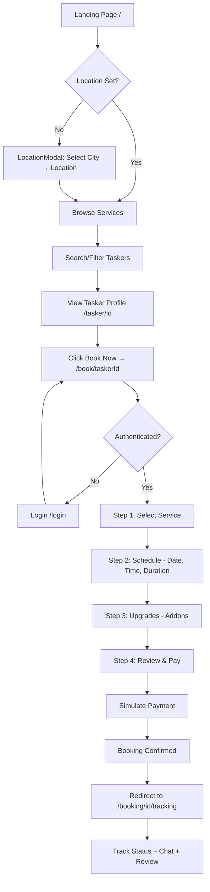

# SewaKhoj End-to-End Playwright Test Plan

## Complete User Journey (Landing → Booking → Tracking)

## Test Structure

### 1. Test Fixtures & Helpers (`tests/fixtures.ts`)
- `authenticatedPage` — creates a test user via Supabase Admin API, signs in, returns page
- `dismissLocationModal` — handles the location modal (select city → location → close)
- `selectServiceFromHome` — clicks a service category on the homepage
- Test user credentials from env vars

### 2. Test Files

#### `tests/landing.spec.ts` — Landing Page & Location
- Page loads with hero, services grid, featured taskers
- Location modal appears, can select city + location
- Search autocomplete works
- Navbar links work (Login, Signup, Browse)

#### `tests/auth.spec.ts` — Authentication
- Login page renders with email/password form + Google button
- Signup page renders with email/phone toggle
- Login with test credentials succeeds
- Redirect after login works

#### `tests/browse.spec.ts` — Service Discovery
- Browse page loads with tasker cards
- Service filter dropdown works
- City filter works
- Rating filter works
- Search query works
- Tasker card links to profile

#### `tests/tasker-profile.spec.ts` — Tasker Profile
- Profile page loads with bio, skills, rating
- Reviews section renders
- "Book Now" button links to booking page

#### `tests/booking.spec.ts` — Full Booking Flow (CRITICAL PATH)
- Booking page loads with tasker info
- Step 1: Select a service from dropdown
- Step 2: Pick date, time slot, duration
- Step 3: Toggle addons
- Step 4: Select payment method, agree to terms
- Submit booking → payment simulation → confirmation
- Redirect to tracking page

#### `tests/tracking.spec.ts` — Post-Booking
- Tracking page loads with booking details
- Status steps visible
- Chat tab works
- Review modal can be opened

### 3. Configuration

- `playwright.config.ts` — baseURL=http://localhost:3000, webServer config, retries, reporter
- `.env.test` — test user credentials (email, password)
- `tests/global-setup.ts` — ensure test user exists in Supabase

### 4. Key Technical Decisions

| Concern | Decision |
|---------|----------|
| Auth | Use Supabase `signInWithPassword` in a global setup, store auth state |
| Location Modal | Dismiss via clicking city → location → close, or use `page.evaluate` to set localStorage |
| Payment | `simulatePayment` has 90% success — retry on failure or mock via route interception |
| Test User | Create via Supabase Admin API in global setup, clean up after |
| Dev Server | `webServer` in playwright.config starts `npm run dev` |
| Database | Read-only tests — no real bookings created (intercept Supabase insert calls) |
