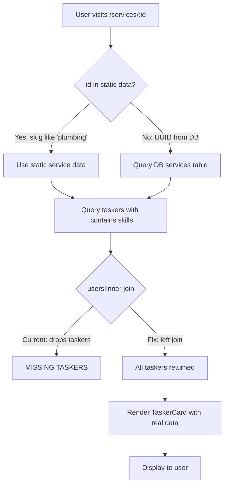

# Service Page Critical Fix Plan

## Audit Summary

The service page at [`src/app/services/[id]/page.tsx`](src/app/services/[id]/page.tsx) has **11 issues** across 4 severity levels. The most critical: UUID-based DB service URLs kill SEO, hardcoded fake data misrepresents taskers, and `users!inner` join silently drops taskers with missing user rows.

---

## Architecture Overview

### Current Data Flow (Broken)
- Static `services.ts` has 12 services with **string slugs** (`plumbing`, `cleaning`)
- DB `services` table has **UUID primary keys** — no slug column
- DB services with UUIDs get ugly URLs like `/services/f46b183e-...`
- TaskerCard receives **hardcoded fake values** instead of real DB metrics

### Target Data Flow (Fixed)
- Migration adds `slug` column to DB `services` table
- UUID-based URLs 301 redirect to slug-based URLs
- TaskerCard receives real data from `completion_count`, `response_time_avg`, `average_rating`
- `users!taskers_user_id_fkey` left join preserves all taskers

---

## Issue Inventory

| # | Severity | Issue | Location | Root Cause |
|---|----------|-------|----------|------------|
| 1 | 🔴 P0 | UUID in URL — zero SEO value | [`page.tsx:29-31`](src/app/services/[id]/page.tsx:29) | DB `services` table has no `slug` column |
| 2 | 🔴 P0 | Fake hardcoded TaskerCard data | [`page.tsx:291-300`](src/app/services/[id]/page.tsx:291) | `experience={2}`, `jobsDone={14}`, `responseTime="<30 min"`, `badges={["Verified","Top Rated"]}` all hardcoded |
| 3 | 🔴 P0 | `users!inner` silently drops taskers | [`page.tsx:148`](src/app/services/[id]/page.tsx:148) | Inner join drops taskers whose user row is missing |
| 4 | 🟠 P1 | No city/location filtering | [`page.tsx:144-151`](src/app/services/[id]/page.tsx:144) | Query has no `.ilike("city", ...)` or location filter |
| 5 | 🟠 P1 | No pagination | [`page.tsx:144-151`](src/app/services/[id]/page.tsx:144) | No `.limit()` — could return hundreds of taskers |
| 6 | 🟠 P1 | `is_featured` selected but unused | [`page.tsx:147`](src/app/services/[id]/page.tsx:147) | Selected in query but never used for sorting/boosting |
| 7 | 🟡 P2 | Contradictory response time claims | [`page.tsx:231`](src/app/services/[id]/page.tsx:231) vs [`page.tsx:351`](src/app/services/[id]/page.tsx:351) | Hero says "<30 min", Why Choose says "24 hours" |
| 8 | 🟡 P2 | Empty state only links to post-task | [`page.tsx:307-318`](src/app/services/[id]/page.tsx:307) | No links to related services or browse page |
| 9 | 🟡 P2 | Hardcoded `areaServed` in JSON-LD | [`page.tsx:64`](src/app/services/[id]/page.tsx:64) | Always `["Kathmandu","Lalitpur","Bhaktapur","Pokhara"]` |
| 10 | 🟢 P3 | Fragile `#taskers-list` anchor link | [`page.tsx:207`](src/app/services/[id]/page.tsx:207) | Breaks if section ID changes; no smooth scroll |
| 11 | 🟢 P3 | No Nepali URL variant / hreflang | [`page.tsx:102-104`](src/app/services/[id]/page.tsx:102) | Missing `alternates.languages` for `ne_NP` |

---

## Implementation Plan

### Phase 1: Database Foundation (P0)

#### Task 1.1: Add `slug` column to services table
- **File**: New migration `045_add_service_slugs.sql`
- **Action**: `ALTER TABLE public.services ADD COLUMN slug TEXT UNIQUE`
- **Backfill**: Generate slugs from `name` column (lowercase, hyphenated)
- **Index**: `CREATE INDEX idx_services_slug ON public.services(slug)`

#### Task 1.2: Update static services data to include DB UUIDs
- **File**: [`src/data/services.ts`](src/data/services.ts)
- **Action**: Add optional `dbId?: string` field to `Service` interface for mapping static slugs to DB UUIDs

### Phase 2: URL & SEO Fixes (P0)

#### Task 2.1: UUID-to-slug redirect
- **File**: [`src/app/services/[id]/page.tsx`](src/app/services/[id]/page.tsx)
- **Logic**: If `id` looks like a UUID (regex match), query DB for the service, get its slug, and `redirect()` (301) to `/services/{slug}`
- **Pattern**: Same approach as Next.js `permanentRedirect`

#### Task 2.2: Fix `generateStaticParams` for DB services
- **File**: [`src/app/services/[id]/page.tsx`](src/app/services/[id]/page.tsx)
- **Action**: Also generate params for DB services that have slugs (not just static data)

#### Task 2.3: Dynamic `areaServed` in JSON-LD
- **File**: [`src/app/services/[id]/page.tsx:64`](src/app/services/[id]/page.tsx:64)
- **Action**: Query distinct cities from taskers table for this service, use as `areaServed`

#### Task 2.4: Add Nepali hreflang alternate
- **File**: [`src/app/services/[id]/page.tsx:102-104`](src/app/services/[id]/page.tsx:102)
- **Action**: Add `languages: { "ne_NP": \`/ne/services/${id}\` }` to alternates (prepare for future i18n)

### Phase 3: Data Integrity Fixes (P0)

#### Task 3.1: Fix `users!inner` → left join
- **File**: [`src/app/services/[id]/page.tsx:148`](src/app/services/[id]/page.tsx:148)
- **Change**: `users!inner` → `users!taskers_user_id_fkey`
- **Impact**: Taskers without user rows will still appear (with fallback name/initials)

#### Task 3.2: Replace hardcoded TaskerCard props with real DB data
- **File**: [`src/app/services/[id]/page.tsx:284-303`](src/app/services/[id]/page.tsx:284)
- **Changes**:
  - `experience={2}` → `experience={parseInt(tasker.experience) || 0}` (DB `experience` is TEXT)
  - `jobsDone={14}` → `jobsDone={tasker.completion_count || tasker.total_jobs || 0}`
  - `responseTime="<30 min"` → `responseTime={tasker.response_time_avg ? \`${tasker.response_time_avg} min\` : "N/A"}`
  - `badges={["Verified", "Top Rated"]}` → compute dynamically:
    - `"Verified"` if `tasker.id_verified === true`
    - `"Top Rated"` if `tasker.average_rating >= 4.5` or `tasker.is_elite === true`
    - `"New"` if `tasker.completion_count < 5`
  - `rating={tasker.rating || 5.0}` → `rating={tasker.average_rating || tasker.rating || 5.0}`
- **Add to select query**: `id_verified`, `experience`, `completion_count`, `response_time_avg`, `average_rating`, `is_elite`, `total_jobs`

#### Task 3.3: Add city filtering to the query
- **File**: [`src/app/services/[id]/page.tsx:144-151`](src/app/services/[id]/page.tsx:144)
- **Action**: Accept optional `?city=` search param, add `.ilike("city", `%${city}%`)` when present
- **Default**: No city filter (show all), but sort by proximity if location available

#### Task 3.4: Add pagination
- **File**: [`src/app/services/[id]/page.tsx:144-151`](src/app/services/[id]/page.tsx:144)
- **Action**: Add `.limit(20)` with optional `?page=` search param for offset

#### Task 3.5: Use `is_featured` for sorting
- **File**: [`src/app/services/[id]/page.tsx:144-151`](src/app/services/[id]/page.tsx:144)
- **Action**: Add `.order("is_featured", { ascending: false })` before other ordering

### Phase 4: Content & UX Fixes (P1-P2)

#### Task 4.1: Fix contradictory response time claims
- **File**: [`src/app/services/[id]/page.tsx:351`](src/app/services/[id]/page.tsx:351)
- **Change**: "We respond within 24 hours" → "Most taskers respond within 30 minutes during business hours"
- **Align**: Hero card (line 231) and Why Choose section (line 351) must match

#### Task 4.2: Improve empty state CTAs
- **File**: [`src/app/services/[id]/page.tsx:307-318`](src/app/services/[id]/page.tsx:307)
- **Add**: Links to related services, browse page, and "Become a Tasker" CTA
- **Pattern**: Same as [`[city]/page.tsx:229-244`](src/app/services/[id]/[city]/page.tsx:229) empty state

#### Task 4.3: Fix fragile anchor link
- **File**: [`src/app/services/[id]/page.tsx:207`](src/app/services/[id]/page.tsx:207)
- **Option A**: Replace `href="#taskers-list"` with a client component that uses `scrollIntoView({ behavior: 'smooth' })`
- **Option B**: Keep the anchor but ensure the ID is stable (already `id="taskers-list"` on line 253)

### Phase 5: Cross-Page Consistency

#### Task 5.1: Apply same fixes to city service page
- **File**: [`src/app/services/[id]/[city]/page.tsx`](src/app/services/[id]/[city]/page.tsx)
- **Already fixed**: Uses `users!taskers_user_id_fkey` (line 102), has city filtering, has pagination (`.limit(12)`)
- **Still needs**: Real DB data for TaskerCard props (lines 215-219 still have `experience={0}`, `jobsDone={0}`, `responseTime="Same day"`)
- **Still needs**: Add `id_verified`, `completion_count`, `response_time_avg`, `average_rating`, `is_elite` to select query

#### Task 5.2: Apply same fixes to Browse page
- **File**: [`src/app/browse/page.tsx:63`](src/app/browse/page.tsx:63)
- **Still uses**: `users!inner` — needs same fix
- **Still uses**: No real metrics in TaskerCard (handled in [`BrowseClient.tsx`](src/app/browse/BrowseClient.tsx))

---

## Execution Order

| Phase | Tasks | Dependencies | Risk |
|-------|-------|-------------|------|
| **Phase 1** | 1.1, 1.2 | None | Low — additive migration |
| **Phase 2** | 2.1, 2.2, 2.3, 2.4 | Phase 1 (slug column) | Medium — redirect logic |
| **Phase 3** | 3.1, 3.2, 3.3, 3.4, 3.5 | Phase 1 | Medium — query changes |
| **Phase 4** | 4.1, 4.2, 4.3 | None | Low — content only |
| **Phase 5** | 5.1, 5.2 | Phase 3 (pattern established) | Low — copy pattern |

---

## Files Modified (Summary)

| File | Phases | Type of Change |
|------|--------|---------------|
| `supabase/migrations/045_add_service_slugs.sql` | Phase 1 | **NEW** — Migration |
| [`src/data/services.ts`](src/data/services.ts) | Phase 1 | Add `dbId` field |
| [`src/app/services/[id]/page.tsx`](src/app/services/[id]/page.tsx) | Phase 2, 3, 4 | Major rewrite of query + render |
| [`src/app/services/[id]/[city]/page.tsx`](src/app/services/[id]/[city]/page.tsx) | Phase 5 | Query + TaskerCard props |
| [`src/app/browse/page.tsx`](src/app/browse/page.tsx) | Phase 5 | Join fix |
| [`src/app/browse/BrowseClient.tsx`](src/app/browse/BrowseClient.tsx) | Phase 5 | TaskerCard props |