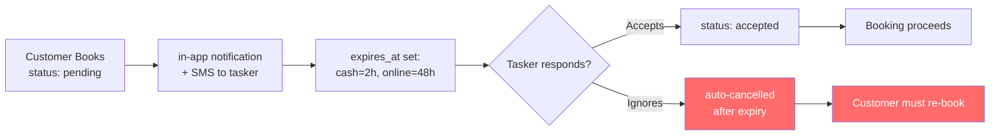
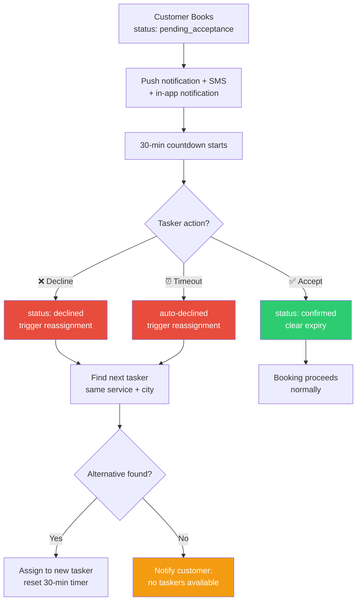

# Tasker Booking Acceptance System — Implementation Plan

## Overview

Replace the current passive booking flow (`pending` → tasker may or may not see it → auto-cancel after 2-48h) with an active acceptance system where taskers must explicitly **Accept** or **Decline** within a 30-minute window, with auto-reassignment on timeout.

---

## Current State (What Exists)



**Problems identified:**
1. No push notification on new booking — only in-app notification (tasker must open app to see it)
2. No explicit "Decline" action — tasker can only ignore
3. Cash bookings expire in 2 hours — too short if tasker is sleeping/away
4. No reassignment — customer must manually re-book
5. No metrics tracking — can't identify ghosting taskers

---

## Target State (What We're Building)



---

## Part 1: Database Migration (`060_tasker_acceptance_system.sql`)

### 1.1 New Status Value

Add `pending_acceptance` and `declined` to the bookings status constraint:

```sql
ALTER TABLE public.bookings DROP CONSTRAINT IF EXISTS bookings_status_check;
ALTER TABLE public.bookings ADD CONSTRAINT bookings_status_check
  CHECK (status IN (
    'pending_acceptance', 'pending', 'confirmed', 'accepted', 'declined',
    'rejected', 'on-the-way', 'arrived', 'in-progress', 'completed', 
    'cancelled', 'disputed'
  ));
```

### 1.2 New Columns on `bookings`

```sql
ALTER TABLE public.bookings
  ADD COLUMN IF NOT EXISTS acceptance_deadline TIMESTAMPTZ,
  ADD COLUMN IF NOT EXISTS reassignment_count INTEGER DEFAULT 0,
  ADD COLUMN IF NOT EXISTS original_tasker_id UUID REFERENCES public.taskers(id),
  ADD COLUMN IF NOT EXISTS declined_by UUID[] DEFAULT ARRAY[]::UUID[];
```

| Column | Purpose |
|---|---|
| `acceptance_deadline` | 30-min countdown timer (replaces `expires_at` for acceptance phase) |
| `reassignment_count` | Track how many times booking was reassigned (max 3) |
| `original_tasker_id` | Remember who was first assigned (for metrics) |
| `declined_by` | Array of tasker IDs who declined (don't re-offer to them) |

### 1.3 New Table: `tasker_acceptance_metrics`

```sql
CREATE TABLE IF NOT EXISTS public.tasker_acceptance_metrics (
  id UUID DEFAULT uuid_generate_v4() PRIMARY KEY,
  tasker_id UUID REFERENCES public.taskers(id) ON DELETE CASCADE UNIQUE,
  total_requests INTEGER DEFAULT 0,
  accepted_count INTEGER DEFAULT 0,
  declined_count INTEGER DEFAULT 0,
  timeout_count INTEGER DEFAULT 0,
  avg_response_seconds DOUBLE PRECISION,
  last_updated TIMESTAMPTZ DEFAULT now(),
  flagged_for_review BOOLEAN DEFAULT false,
  flagged_at TIMESTAMPTZ
);
```

### 1.4 Updated Status Transition Validation

Add transitions for `pending_acceptance` and `declined`:

```sql
-- In validate_booking_status_transition():
WHEN 'pending_acceptance' THEN
  IF NEW.status NOT IN ('confirmed', 'declined', 'cancelled') THEN
    RAISE EXCEPTION 'Cannot transition from pending_acceptance to %', NEW.status;
  END IF;
WHEN 'declined' THEN
  IF NEW.status NOT IN ('pending_acceptance', 'cancelled') THEN
    RAISE EXCEPTION 'Cannot transition from declined to %', NEW.status;
  END IF;
```

### 1.5 New Trigger: `notify_new_booking()` (Push on INSERT)

```sql
CREATE OR REPLACE FUNCTION public.notify_new_booking()
RETURNS TRIGGER AS $$
DECLARE
  v_tasker_user_id UUID;
  v_customer_name TEXT;
  v_service_name TEXT;
BEGIN
  -- Only fire for pending_acceptance status
  IF NEW.status != 'pending_acceptance' THEN
    RETURN NEW;
  END IF;

  -- Get tasker's user_id
  SELECT t.user_id INTO v_tasker_user_id
  FROM public.taskers t WHERE t.id = NEW.tasker_id;

  -- Get customer name
  SELECT u.full_name INTO v_customer_name
  FROM public.users u WHERE u.id = NEW.customer_id;

  -- Get service name
  SELECT s.name INTO v_service_name
  FROM public.services s WHERE s.id = NEW.service;

  -- Send push notification via Edge Function
  PERFORM net.http_post(
    url := 'https://sewakhoj.com/api/push/send',
    headers := '{"Content-Type":"application/json"}'::jsonb,
    body := json_build_object(
      'user_id', v_tasker_user_id,
      'title', 'New Booking Request 🔔',
      'body', COALESCE(v_customer_name, 'Customer') || ' needs ' || COALESCE(v_service_name, NEW.service),
      'data', json_build_object(
        'booking_id', NEW.id,
        'type', 'new_booking',
        'url', '/dashboard?section=tasks&booking=' || NEW.id
      )
    )::jsonb
  );

  RETURN NEW;
END;
$$ LANGUAGE plpgsql SECURITY DEFINER;

DROP TRIGGER IF EXISTS trg_notify_new_booking ON public.bookings;
CREATE TRIGGER trg_notify_new_booking
  AFTER INSERT ON public.bookings
  FOR EACH ROW
  EXECUTE FUNCTION public.notify_new_booking();
```

### 1.6 New Trigger: `set_acceptance_deadline()`

```sql
CREATE OR REPLACE FUNCTION public.set_acceptance_deadline()
RETURNS TRIGGER AS $$
BEGIN
  IF NEW.status = 'pending_acceptance' AND NEW.acceptance_deadline IS NULL THEN
    NEW.acceptance_deadline := now() + INTERVAL '30 minutes';
  END IF;
  
  -- Clear deadline when accepted/declined
  IF NEW.status IN ('confirmed', 'declined', 'cancelled') THEN
    NEW.acceptance_deadline := NULL;
  END IF;
  
  RETURN NEW;
END;
$$ LANGUAGE plpgsql;

DROP TRIGGER IF EXISTS trg_set_acceptance_deadline ON public.bookings;
CREATE TRIGGER trg_set_acceptance_deadline
  BEFORE INSERT OR UPDATE OF status
  ON public.bookings
  FOR EACH ROW
  EXECUTE FUNCTION public.set_acceptance_deadline();
```

### 1.7 New Function: `auto_reassign_expired_acceptances()`

```sql
CREATE OR REPLACE FUNCTION public.auto_reassign_expired_acceptances()
RETURNS TABLE (
  booking_id UUID,
  old_tasker_id UUID,
  new_tasker_id UUID,
  outcome TEXT
) AS $$
DECLARE
  expired RECORD;
  v_new_tasker_id UUID;
  v_max_reassignments INTEGER := 3;
BEGIN
  FOR expired IN
    SELECT b.id, b.tasker_id, b.service, b.city, b.customer_id,
           b.reassignment_count, b.declined_by, b.original_tasker_id
    FROM public.bookings b
    WHERE b.status = 'pending_acceptance'
      AND b.acceptance_deadline IS NOT NULL
      AND b.acceptance_deadline < now()
      AND b.reassignment_count < v_max_reassignments
  LOOP
    -- Mark current tasker as timed out
    UPDATE public.bookings
    SET status = 'declined',
        declined_by = COALESCE(declined_by, ARRAY[]::UUID[]) || expired.tasker_id,
        reassignment_count = COALESCE(reassignment_count, 0) + 1,
        original_tasker_id = COALESCE(original_tasker_id, expired.tasker_id)
    WHERE id = expired.id;

    -- Update metrics: timeout
    INSERT INTO public.tasker_acceptance_metrics (tasker_id, total_requests, timeout_count)
    VALUES (expired.tasker_id, 1, 1)
    ON CONFLICT (tasker_id)
    DO UPDATE SET
      total_requests = tasker_acceptance_metrics.total_requests + 1,
      timeout_count = tasker_acceptance_metrics.timeout_count + 1,
      last_updated = now();

    -- Find next available tasker (same service, same city, not declined, active)
    SELECT t.id INTO v_new_tasker_id
    FROM public.taskers t
    JOIN public.tasker_skills ts ON t.id = ts.tasker_id AND ts.service_id = expired.service
    WHERE t.status = 'active'
      AND t.id != expired.tasker_id
      AND t.id != ALL(COALESCE(expired.declined_by, ARRAY[]::UUID[]))
      AND t.city ILIKE '%' || COALESCE(expired.city, '') || '%'
    ORDER BY t.is_elite DESC, t.rating DESC, t.total_jobs DESC
    LIMIT 1;

    IF v_new_tasker_id IS NOT NULL THEN
      -- Reassign to new tasker
      UPDATE public.bookings
      SET tasker_id = v_new_tasker_id,
          status = 'pending_acceptance',
          acceptance_deadline = now() + INTERVAL '30 minutes'
      WHERE id = expired.id;

      -- Notify customer
      INSERT INTO public.notifications (user_id, title, message, type, link)
      VALUES (
        expired.customer_id,
        'Finding You a Tasker 🔄',
        'Your previous tasker did not respond. We are assigning a new tasker.',
        'info',
        '/booking/' || expired.id || '/tracking'
      );

      -- Notify original tasker
      INSERT INTO public.notifications (user_id, title, message, type, link)
      SELECT t.user_id, 'Booking Reassigned ⏰', 
             'You did not respond in time. The booking has been reassigned.',
             'alert', '/dashboard'
      FROM public.taskers t WHERE t.id = expired.tasker_id;

      booking_id := expired.id;
      old_tasker_id := expired.tasker_id;
      new_tasker_id := v_new_tasker_id;
      outcome := 'reassigned';
      RETURN NEXT;
    ELSE
      -- No alternative tasker found
      UPDATE public.bookings
      SET status = 'cancelled'
      WHERE id = expired.id;

      INSERT INTO public.notifications (user_id, title, message, type, link)
      VALUES (
        expired.customer_id,
        'No Taskers Available 😔',
        'Sorry, no taskers are currently available for this service in your area. Please try again later.',
        'alert',
        '/browse'
      );

      booking_id := expired.id;
      old_tasker_id := expired.tasker_id;
      new_tasker_id := NULL;
      outcome := 'cancelled_no_taskers';
      RETURN NEXT;
    END IF;
  END LOOP;
END;
$$ LANGUAGE plpgsql SECURITY DEFINER;
```

### 1.8 New Function: `flag_low_acceptance_taskers()`

```sql
CREATE OR REPLACE FUNCTION public.flag_low_acceptance_taskers()
RETURNS TABLE (
  tasker_id UUID,
  acceptance_rate NUMERIC,
  total_requests INTEGER
) AS $$
BEGIN
  RETURN QUERY
  UPDATE public.tasker_acceptance_metrics tam
  SET flagged_for_review = true,
      flagged_at = now()
  WHERE tam.total_requests >= 10
    AND (tam.accepted_count::NUMERIC / NULLIF(tam.total_requests, 0)) < 0.5
    AND tam.flagged_for_review = false
  RETURNING tam.tasker_id, 
            ROUND((tam.accepted_count::NUMERIC / NULLIF(tam.total_requests, 0)) * 100, 1) AS acceptance_rate,
            tam.total_requests;
END;
$$ LANGUAGE plpgsql SECURITY DEFINER;
```

### 1.9 Update `set_booking_expiry()` for New Flow

Modify the existing trigger from migration 049:
- `pending_acceptance` → set `acceptance_deadline` to 30 min (not `expires_at`)
- Keep `expires_at` for legacy `pending` status (backward compat)
- Cash payment: 12 hours (was 2 hours)

---

## Part 2: API Routes

### 2.1 `POST /api/bookings/accept`

**File:** `src/app/api/bookings/accept/route.ts`

```typescript
// Body: { bookingId: string }
// Validates: booking belongs to authenticated tasker, status is 'pending_acceptance'
// Action: UPDATE status = 'confirmed', clear acceptance_deadline
// Side effects: update tasker_acceptance_metrics (accepted_count, avg_response_time)
// Returns: { success: true, booking: {...} }
```

### 2.2 `POST /api/bookings/decline`

**File:** `src/app/api/bookings/decline/route.ts`

```typescript
// Body: { bookingId: string, reason?: string }
// Validates: booking belongs to authenticated tasker, status is 'pending_acceptance'
// Action: UPDATE status = 'declined', add tasker to declined_by[]
// Side effects: update tasker_acceptance_metrics (declined_count)
//              trigger auto_reassign_expired_acceptances() immediately
// Returns: { success: true }
```

### 2.3 `POST /api/bookings/reassign`

**File:** `src/app/api/bookings/reassign/route.ts`

```typescript
// Body: { bookingId: string }
// Admin-only endpoint for manual reassignment
// Action: calls auto_reassign_expired_acceptances() for specific booking
```

---

## Part 3: Frontend Changes

### 3.1 Booking Creation Page

**File:** [`src/app/book/[taskerId]/page.tsx`](src/app/book/[taskerId]/page.tsx)

Changes at line 549:
```diff
- status: 'pending',
+ status: 'pending_acceptance',
```

Also update the confirmation message to tell customer: "Tasker has 30 minutes to respond."

### 3.2 Tasker Dashboard — New "Pending Acceptance" Section

**File:** [`src/app/dashboard/page.tsx`](src/app/dashboard/page.tsx)

Add a new prominent section at the TOP of the tasker view when there are `pending_acceptance` bookings:

```tsx
// New component: PendingAcceptanceBanner
// Shows:
// - Red pulsing badge with count
// - Each booking card with:
//   - Service name + emoji
//   - Customer name
//   - Date + time
//   - Location
//   - Budget
//   - 30-min countdown timer (real-time)
//   - Two large buttons: "✅ Accept" and "❌ Decline"
```

The countdown timer reuses the existing pattern from [`BookingDetailModal`](src/app/dashboard/page.tsx:2303) which already has `expiryCountdown` state with `setInterval`.

### 3.3 Tasks Section Filter Update

**File:** [`src/app/dashboard/page.tsx:1446`](src/app/dashboard/page.tsx:1446)

Add `pending_acceptance` to filter tabs:
```diff
- {['all', 'pending', 'accepted', 'completed'].map(f => (
+ {['all', 'pending_acceptance', 'pending', 'accepted', 'completed'].map(f => (
```

### 3.4 Booking Detail Modal Update

**File:** [`src/app/dashboard/page.tsx:2293`](src/app/dashboard/page.tsx:2293)

For `pending_acceptance` bookings, show Accept/Decline buttons prominently in the modal instead of the normal status progression buttons.

### 3.5 Customer Tracking Page

Show real-time status: "Waiting for tasker to accept... (12:34 remaining)"

---

## Part 4: Admin Panel

### 4.1 Flagged Taskers Section

**File:** [`src/app/admin/operations/OperationsDashboard.tsx`](src/app/admin/operations/OperationsDashboard.tsx)

Add a new card/section showing taskers flagged for low acceptance rate:

```tsx
// Query: tasker_acceptance_metrics WHERE flagged_for_review = true
// Display:
// - Tasker name + avatar
// - Acceptance rate (e.g., "33% — 4/12 accepted")
// - Avg response time
// - Ghost count (timeouts)
// - Action buttons: "Review Tasker", "Suspend", "Send Warning"
```

### 4.2 New Admin Tab: "Acceptance Monitor"

Add a dedicated view with:
- All taskers sorted by acceptance rate
- Filter by date range
- Export to CSV
- Bulk actions (warn, suspend)

---

## Part 5: Edge Cases & Error Handling

| Scenario | Handling |
|---|---|
| **Tasker accepts after timeout** | API returns error: "Booking has expired. It has been reassigned." |
| **All taskers decline/timeout** | Booking cancelled, customer notified, admin alerted |
| **Customer cancels during acceptance** | Status → `cancelled`, tasker notified "Booking was cancelled by customer" |
| **Tasker app is closed** | Push notification wakes device; SMS as fallback |
| **Network failure during accept** | Retry with exponential backoff; idempotent (check status first) |
| **Concurrent accepts (race condition)** | Database-level: `WHERE status = 'pending_acceptance'` ensures only one tasker can accept |
| **Tasker declines, no alternatives** | Booking cancelled; suggest customer browse other taskers |
| **Same tasker gets re-offered** | `declined_by[]` array prevents re-offering to taskers who already declined |
| **Max reassignments (3) reached** | Booking cancelled; admin notified for manual intervention |

---

## Part 6: Implementation Order

| Step | File(s) | Description |
|---|---|---|
| 1 | `supabase/migrations/060_tasker_acceptance_system.sql` | Database migration (new status, table, triggers, functions) |
| 2 | `src/app/api/bookings/accept/route.ts` | Accept API endpoint |
| 3 | `src/app/api/bookings/decline/route.ts` | Decline API endpoint |
| 4 | `src/app/book/[taskerId]/page.tsx` | Change status to `pending_acceptance` |
| 5 | `src/app/dashboard/page.tsx` | PendingAcceptanceBanner + filter update + modal update |
| 6 | `src/app/admin/operations/OperationsDashboard.tsx` | Flagged taskers section |
| 7 | `tests/booking-acceptance.spec.ts` | New E2E test spec |
| 8 | Run all tests, fix issues, push |

---

## Part 7: Rollback Plan

If the new system causes issues in production:

1. Revert `book/[taskerId]/page.tsx` to use `status: 'pending'` instead of `pending_acceptance`
2. The old `set_booking_expiry()` trigger still works for `pending` status
3. New triggers only fire on `pending_acceptance` — no impact on legacy `pending` bookings
4. `tasker_acceptance_metrics` table can be dropped if needed (no FK dependencies)