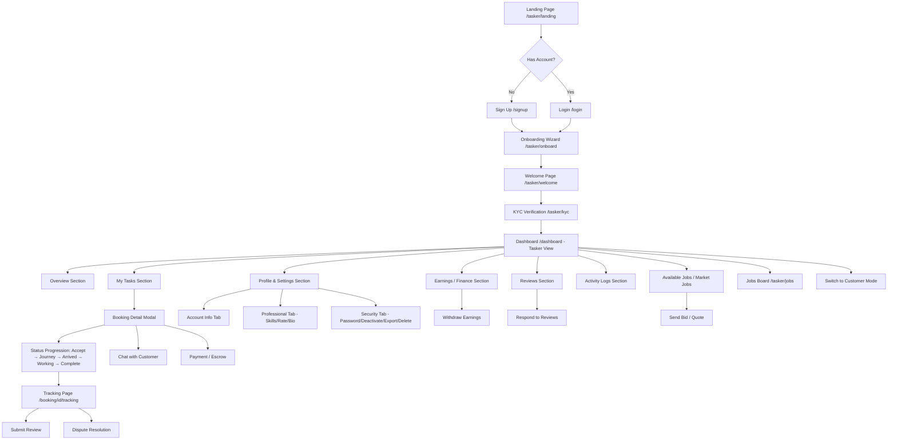

# Tasker E2E Test Plan — Every Single Step

## Complete Tasker Journey Map

## Test Specs & Structure

### Spec 1: `tests/tasker-landing.spec.ts` — Discovery & Landing (6 tests)
| # | Test | What It Validates |
|---|------|-------------------|
| 1 | Landing page loads with hero section | `/tasker/landing` renders, hero heading visible |
| 2 | Benefits section shows all 4 cards | Earn More, Flexible Schedule, Verification Badge, Build Reputation |
| 3 | "Get Started" CTA links to signup with redirect | `href="/signup?redirect=/tasker/onboard"` |
| 4 | "Browse Services" link works | Links to `/browse` |
| 5 | How It Works steps are visible | 3 steps: Tell Us About Yourself, Set Your Rates, Start Earning |
| 6 | FAQ section is present | FAQ accordion items visible |

### Spec 2: `tests/tasker-onboarding.spec.ts` — Onboarding Wizard (10 tests)
| # | Test | What It Validates |
|---|------|-------------------|
| 1 | Onboarding page requires authentication | Redirects to `/login?redirect=/tasker/onboard` when not logged in |
| 2 | Already-registered tasker redirects to dashboard | Tasker with existing profile gets redirected |
| 3 | Step 1 — Personal Info form renders | Full name, phone, email, DOB, gender, city, area fields visible |
| 4 | Step 1 — City dropdown populated from DB | City select has options from `cities` table |
| 5 | Step 2 — Skills search and selection | Search services, add/remove skills, set skill levels |
| 6 | Step 3 — Availability grid renders | Day columns, time slots (morning/afternoon/evening), bulk actions |
| 7 | Step 4 — Document upload section | Citizenship, license, other file inputs visible |
| 8 | Step 5 — Pricing configuration | Hourly rate input, pricing type, transport mode select |
| 9 | Step 6 — Finalize review and submit | Review summary, code of conduct checkbox, privacy agreement, submit button |
| 10 | Progress persistence across steps | Navigate forward/back, form data preserved |

### Spec 3: `tests/tasker-welcome.spec.ts` — Post-Submission Welcome (4 tests)
| # | Test | What It Validates |
|---|------|-------------------|
| 1 | Welcome page requires authentication | Redirects when not logged in |
| 2 | Non-tasker redirects to onboarding | User without tasker profile gets redirected |
| 3 | Active tasker redirects to dashboard | Verified tasker skips welcome page |
| 4 | Pending tasker sees review status | "Application Under Review" card, pending verification badge, tips section |

### Spec 4: `tests/tasker-kyc.spec.ts` — KYC Verification (5 tests)
| # | Test | What It Validates |
|---|------|-------------------|
| 1 | KYC page requires authentication | Redirects when not logged in |
| 2 | KYC page loads 3-step wizard | Step indicators (1, 2, 3) visible |
| 3 | Step 1 — Document type selection | Citizenship, Driving License, Passport options |
| 4 | Step 2 — Document upload interface | Front/back file inputs, preview functionality |
| 5 | Step 3 — Selfie/biometric capture | Camera input, preview, submit button |

### Spec 5: `tests/tasker-dashboard.spec.ts` — Dashboard Tasker View (12 tests)
| # | Test | What It Validates |
|---|------|-------------------|
| 1 | Dashboard requires authentication | Redirects when not logged in |
| 2 | Tasker view sidebar has correct sections | Overview, My Tasks, Earnings, Reviews, Profile, Logs, Available Jobs |
| 3 | Overview shows stats cards | Active Jobs, Completed, Total Earnings, Net Wallet |
| 4 | Pending tasker sees verification roadmap | 4-step roadmap with progress indicators |
| 5 | My Tasks section with status filters | Filter buttons: all, pending, accepted, completed |
| 6 | Booking detail modal opens on click | Customer info, address, date/time, payment details |
| 7 | Tasker can accept a pending booking | Accept button → status changes to accepted |
| 8 | Status progression: accepted → on-the-way | Start Journey button visible and functional |
| 9 | Status progression: on-the-way → arrived | I've Arrived button with timestamp |
| 10 | Status progression: arrived → in-progress | Start Working button |
| 11 | Status progression: in-progress → completed | Mark Complete with amount adjustment option |
| 12 | Scheduling conflict warning | Warning shown when double-booking detected |

### Spec 6: `tests/tasker-finance.spec.ts` — Earnings & Finance (4 tests)
| # | Test | What It Validates |
|---|------|-------------------|
| 1 | Finance section shows available balance | Balance card with total earnings |
| 2 | Pending earnings displayed separately | Pending amount shown below balance |
| 3 | Withdraw button is present | Withdraw CTA visible |
| 4 | Recent transactions ledger renders | Transaction list with type, date, amount |

### Spec 7: `tests/tasker-reviews.spec.ts` — Reviews Management (4 tests)
| # | Test | What It Validates |
|---|------|-------------------|
| 1 | Reviews section shows average rating | Star rating display, total count |
| 2 | Review list renders with customer info | Customer name, avatar, rating, comment, date |
| 3 | Tasker can respond to a review | Response textarea, submit button |
| 4 | Empty state when no reviews | "No reviews yet" message shown |

### Spec 8: `tests/tasker-profile-settings.spec.ts` — Profile & Settings (5 tests)
| # | Test | What It Validates |
|---|------|-------------------|
| 1 | Account Info tab renders | Full name, email, phone, DOB, gender, city fields |
| 2 | Professional tab renders (tasker only) | Skills multi-select, hourly rate, experience, bio |
| 3 | Security tab — change password form | Current password, new password, confirm fields |
| 4 | Security tab — deactivate account option | Deactivate button with confirmation |
| 5 | Security tab — export data option | Export button visible |

### Spec 9: `tests/tasker-jobs-board.spec.ts` — Jobs Board (5 tests)
| # | Test | What It Validates |
|---|------|-------------------|
| 1 | Jobs board requires authentication | Redirects when not logged in |
| 2 | Non-tasker redirects to onboarding | User without tasker profile redirected |
| 3 | Jobs board loads with header and stats | "Available Missions" heading, open jobs count, completed count |
| 4 | Job cards show service, city, budget, take-home | Service emoji, city, description, budget breakdown |
| 5 | Accept job button works | Click accept → job removed from list, success notification |

### Spec 10: `tests/tasker-market-jobs.spec.ts` — Market Jobs / Bidding (4 tests)
| # | Test | What It Validates |
|---|------|-------------------|
| 1 | Market Jobs section loads in dashboard | "Available Jobs" heading, task cards |
| 2 | Task cards show budget and location | Budget amount, location name |
| 3 | Send Bid button is present | "Send Quote / Bid" button on each card |
| 4 | Already-bid tasks show "Bid Sent" | Green badge when bid already placed |

### Spec 11: `tests/tasker-mode-switch.spec.ts` — Mode Switching (3 tests)
| # | Test | What It Validates |
|---|------|-------------------|
| 1 | Switch to Customer Mode button visible | Toggle button in sidebar for dual-role users |
| 2 | Switching modes changes sidebar | Customer sidebar shows different items |
| 3 | Mode persists via sessionStorage | Reload preserves last selected mode |

### Spec 12: `tests/tasker-verification.spec.ts` — Verification Info Page (3 tests)
| # | Test | What It Validates |
|---|------|-------------------|
| 1 | Verification page loads | `/tasker/verification` renders |
| 2 | Commission model explained | 90/10 split info, example calculation |
| 3 | KYC process steps listed | 3 steps: Document Collection, Biometric, Manual Review |

## Total: 65 tests across 12 specs

## Test Infrastructure Notes

- **Auth**: Tests that require a tasker profile need a test tasker in the DB. Since the DB may not have taskers, all tasker-dependent tests will use graceful skip patterns (same as booking/tracking tests).
- **Global setup**: Already handles sign-in attempt. Tasker tests will use `storageState` from global setup.
- **Helpers**: Existing `dismissLocationModal`, `goToPage`, `expectNavbarVisible`, `waitForStability` will be reused.
- **New helper needed**: `ensureTaskerAuth` — signs in as test user, checks if tasker profile exists, skips test if not.

## Known Limitations

1. **No taskers in DB**: Most tasker-specific tests will skip gracefully (same pattern as booking tests)
2. **File uploads**: KYC document upload tests will validate UI only (no actual file upload to Supabase storage)
3. **Payment flow**: Withdraw button validates presence only (no actual eSewa integration test)
4. **Real-time**: Chat and status updates test UI presence, not real-time WebSocket behavior