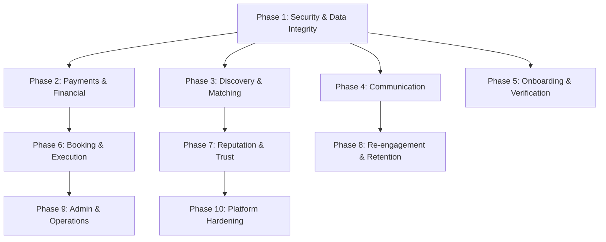

# SewaKhoj Tasker Lifecycle — Comprehensive Implementation Plan

> **Date:** 2026-05-15
> **Source:** [`tasker-lifecycle-analysis.md`](plans/tasker-lifecycle-analysis.md) — 46 recommendations across P0–P3
> **Organization:** 10 logical phases grouped by domain, each containing related fixes regardless of priority tier

---

## Phase Dependency Graph



---

## Phase 1: Security & Data Integrity Foundation

**Covers recommendations:** #4, #5, #3, #9, #12, #13, #15, #7
**Priority:** P0–P1 | **Depends on:** Nothing

### 1.1 — Phone Number Uniqueness Enforcement (#4, P0)

**Problem:** Multiple accounts can share the same phone number. The `users.phone` column has no UNIQUE constraint.

**Implementation:**
1. Create migration `046_enforce_phone_uniqueness.sql`:
   - Add `UNIQUE` constraint on `users.phone` (with `NULLS NOT DISTINCT` if Supabase PG version supports it, or handle NULLs separately)
   - Add `CHECK` constraint for Nepal phone format: `REGEXP_LIKE(phone, '^\+977[0-9]{10}$')` or `'^9[78][0-9]{8}$'`
2. Update [`src/app/signup/SignupClient.tsx`](src/app/signup/SignupClient.tsx):
   - Before sending OTP, query `users` table to check if phone already exists
   - If exists and user has `account_status = 'active'`, show "This phone is already registered. Please log in."
   - If exists and `account_status = 'deactivated'`, allow re-registration after clearing old record
3. Update [`src/app/login/LoginClient.tsx`](src/app/login/LoginClient.tsx):
   - Add phone format validation before submission

**Files to modify:**
- `supabase/migrations/046_enforce_phone_uniqueness.sql` (NEW)
- [`src/app/signup/SignupClient.tsx`](src/app/signup/SignupClient.tsx)
- [`src/app/login/LoginClient.tsx`](src/app/login/LoginClient.tsx)

---

### 1.2 — Server-Side Price Validation (#5, P0)

**Problem:** Booking price is computed client-side and submitted without server verification. A malicious user can modify the price in the browser.

**Implementation:**
1. Create API route `src/app/api/bookings/validate/route.ts`:
   - Accept `taskerId`, `skillId`, `hours`, `addonIds[]`, `promoCode`
   - Fetch tasker's skill pricing from `taskers.skills` JSON
   - Fetch addon prices from `site_settings`
   - Validate promo code via `promo_codes` table
   - Return computed total + breakdown; reject if mismatch
2. Update [`src/app/book/[taskerId]/page.tsx`](src/app/book/[taskerId]/page.tsx):
   - Before `handleBooking()`, call `/api/bookings/validate` endpoint
   - Compare server-computed total with client-computed total
   - If mismatch, show error and block submission
3. Add server-side check in the booking INSERT:
   - Create a `BEFORE INSERT` trigger on `bookings` that recomputes `total_amount` from tasker pricing and rejects if mismatch exceeds 1% tolerance

**Files to modify:**
- `src/app/api/bookings/validate/route.ts` (NEW)
- [`src/app/book/[taskerId]/page.tsx`](src/app/book/[taskerId]/page.tsx)
- `supabase/migrations/046_enforce_phone_uniqueness.sql` (add trigger)

---

### 1.3 — Server-Side Booking Conflict Detection (#3, P0)

**Problem:** Conflict detection in [`src/app/book/[taskerId]/page.tsx`](src/app/book/[taskerId]/page.tsx) (lines 763–770) is purely client-side. Two simultaneous bookings can both pass the check and create a double-booking.

**Implementation:**
1. Create a PostgreSQL function `check_booking_conflict(tasker_id UUID, booking_date DATE, start_time TIME, end_time TIME)`:
   - Returns `BOOLEAN` — TRUE if conflict exists
   - Checks `bookings` table for overlapping time ranges on the same date
   - Excludes cancelled/rejected bookings
2. Create a `BEFORE INSERT` trigger on `bookings`:
   - Calls `check_booking_conflict()`
   - If conflict, raises exception with message "This time slot is no longer available"
3. Update [`src/app/book/[taskerId]/page.tsx`](src/app/book/[taskerId]/page.tsx):
   - Keep client-side check for UX (instant feedback)
   - Add server-side error handling: catch the conflict exception and show "Slot was just taken — please choose another time"

**Files to modify:**
- `supabase/migrations/046_enforce_phone_uniqueness.sql` (add function + trigger)
- [`src/app/book/[taskerId]/page.tsx`](src/app/book/[taskerId]/page.tsx)

---

### 1.4 — Booking Status Transition Validation (#9, P1)

**Problem:** No validation that status transitions follow the legal workflow: `pending → accepted → in_progress → completed`. Code can jump directly from `pending` to `completed`.

**Implementation:**
1. Create a PostgreSQL function `validate_booking_status_transition(old_status TEXT, new_status TEXT)`:
   - Define legal transitions as a JSON map
   - Returns BOOLEAN
2. Create a `BEFORE UPDATE` trigger on `bookings.status`:
   - Calls `validate_booking_status_transition()`
   - Raises exception on illegal transitions
   - Logs all transitions to `booking_logs`
3. Update [`src/app/dashboard/page.tsx`](src/app/dashboard/page.tsx) `updateStatus()` function (line 521):
   - Add client-side transition validation matching server rules
   - Show specific error messages for illegal transitions

**Legal transitions:**
```
pending    → accepted, cancelled, rejected
accepted   → in_progress, cancelled
in_progress → completed, disputed
completed  → disputed
disputed   → completed (admin only)
cancelled  → (terminal)
rejected   → (terminal)
```

**Files to modify:**
- `supabase/migrations/046_enforce_phone_uniqueness.sql` (add function + trigger)
- [`src/app/dashboard/page.tsx`](src/app/dashboard/page.tsx)

---

### 1.5 — Admin Access Control Consistency (#12, P1)

**Problem:** Admin pages use inconsistent patterns — some check `user_roles`, some check `staff_roles`, some check both. The `is_super_admin()` function exists but isn't consistently used.

**Implementation:**
1. Create a shared admin auth utility `src/lib/admin-auth.ts`:
   - `requireAdmin()` — checks `staff_roles` table for any admin role
   - `requireRole(role)` — checks for specific role
   - `isSuperAdmin()` — wraps `is_super_admin()` DB function
   - Returns standardized error responses
2. Audit all admin pages and apply consistent pattern:
   - [`src/app/admin/AdminDashboard.tsx`](src/app/admin/AdminDashboard.tsx)
   - [`src/app/admin/taskers/page.tsx`](src/app/admin/taskers/page.tsx)
   - [`src/app/admin/users/page.tsx`](src/app/admin/users/page.tsx)
   - [`src/app/admin/support/page.tsx`](src/app/admin/support/page.tsx)
   - [`src/app/admin/roles/page.tsx`](src/app/admin/roles/page.tsx)
   - [`src/app/admin/settings/page.tsx`](src/app/admin/settings/page.tsx)
   - [`src/app/admin/marketing/page.tsx`](src/app/admin/marketing/page.tsx)
3. Add middleware check in `src/middleware.ts` (create if not exists):
   - Block non-admin users from `/admin/*` routes at the edge

**Files to modify:**
- `src/lib/admin-auth.ts` (NEW)
- `src/middleware.ts` (NEW or modify)
- All 7 admin page files listed above

---

### 1.6 — API Key Encryption (#13, P1)

**Problem:** [`src/app/admin/settings/components/IntegrationsTab.tsx`](src/app/admin/settings/components/IntegrationsTab.tsx) stores API keys in plain text in the `api_integrations.api_key` column.

**Implementation:**
1. Create a PostgreSQL encryption function using `pgcrypto`:
   - `encrypt_api_key(raw_key TEXT)` → returns BYTEA
   - `decrypt_api_key(encrypted BYTEA)` → returns TEXT
   - Uses `PGP_SYM_ENCRYPT` with a server-side secret from `site_settings`
2. Add migration to:
   - Add `encrypted_api_key BYTEA` column
   - Migrate existing plain-text keys to encrypted
   - Drop `api_key` column
3. Update [`src/app/admin/settings/components/IntegrationsTab.tsx`](src/app/admin/settings/components/IntegrationsTab.tsx):
   - Show masked keys (e.g., `sk_live_****a1b2`)
   - Add "Reveal" toggle that calls a server function to decrypt
   - Never send decrypted keys to the client except on explicit reveal

**Files to modify:**
- `supabase/migrations/047_encrypt_api_keys.sql` (NEW)
- [`src/app/admin/settings/components/IntegrationsTab.tsx`](src/app/admin/settings/components/IntegrationsTab.tsx)
- `src/app/api/admin/reveal-key/route.ts` (NEW)

---

### 1.7 — Skills Referential Integrity (#15, P1)

**Problem:** `taskers.skills` is `TEXT[]` with no foreign key to `services.id`. A tasker can claim a skill for a non-existent or deleted service.

**Implementation:**
1. Create a `tasker_skills` junction table:
   ```sql
   CREATE TABLE tasker_skills (
     id UUID PRIMARY KEY DEFAULT gen_random_uuid(),
     tasker_id UUID REFERENCES taskers(id) ON DELETE CASCADE,
     service_id UUID REFERENCES services(id) ON DELETE CASCADE,
     skill_level TEXT CHECK (skill_level IN ('Beginner', 'Intermediate', 'Expert')),
     created_at TIMESTAMPTZ DEFAULT now(),
     UNIQUE(tasker_id, service_id)
   );
   ```
2. Create a trigger to sync `tasker_skills` → `taskers.skills[]` for backward compatibility
3. Update [`src/app/tasker/onboard/page.tsx`](src/app/tasker/onboard/page.tsx):
   - Write to `tasker_skills` instead of `taskers.skills[]`
4. Update [`src/app/dashboard/page.tsx`](src/app/dashboard/page.tsx):
   - Read from `tasker_skills` joined with `services`
5. Update all queries that reference `taskers.skills`:
   - [`src/app/services/[id]/page.tsx`](src/app/services/[id]/page.tsx)
   - [`src/app/services/[id]/[city]/page.tsx`](src/app/services/[id]/[city]/page.tsx)
   - [`src/app/browse/page.tsx`](src/app/browse/page.tsx)
   - [`src/app/book/[taskerId]/page.tsx`](src/app/book/[taskerId]/page.tsx)

**Files to modify:**
- `supabase/migrations/048_tasker_skills_junction.sql` (NEW)
- [`src/app/tasker/onboard/page.tsx`](src/app/tasker/onboard/page.tsx)
- [`src/app/dashboard/page.tsx`](src/app/dashboard/page.tsx)
- [`src/app/services/[id]/page.tsx`](src/app/services/[id]/page.tsx)
- [`src/app/services/[id]/[city]/page.tsx`](src/app/services/[id]/[city]/page.tsx)
- [`src/app/browse/page.tsx`](src/app/browse/page.tsx)
- [`src/app/book/[taskerId]/page.tsx`](src/app/book/[taskerId]/page.tsx)

---

### 1.8 — Commission Ledger Immutability (#7, P1)

**Problem:** The `commission_ledger` table has no immutability enforcement. Entries can be modified or deleted after creation.

**Implementation:**
1. Add a `BEFORE UPDATE` trigger on `commission_ledger`:
   - Reject all UPDATE operations (raise exception)
   - Allow only INSERT and SELECT
2. Add a `BEFORE DELETE` trigger:
   - Reject all DELETE operations
   - Instead, allow a "reversal entry" pattern: insert a new row with negated amounts
3. Add `created_by` and `reversal_of` columns for audit trail

**Files to modify:**
- `supabase/migrations/046_enforce_phone_uniqueness.sql` (add triggers)

---

## Phase 2: Payments & Financial Infrastructure

**Covers recommendations:** #1, #8, #16, #31
**Priority:** P0–P3 | **Depends on:** Phase 1

### 2.1 — Tasker Payout/Disbursement Mechanism (#1, P0)

**Problem:** Commission is tracked in `commission_ledger` but there is zero infrastructure for actually paying taskers. This is the single most critical gap — the platform cannot function without it.

**Implementation:**
1. Create `payouts` table:
   ```sql
   CREATE TABLE payouts (
     id UUID PRIMARY KEY DEFAULT gen_random_uuid(),
     tasker_id UUID REFERENCES taskers(id) NOT NULL,
     amount NUMERIC(10,2) NOT NULL,
     payout_method TEXT CHECK (payout_method IN ('esewa', 'khalti', 'bank_transfer', 'cash_pickup')),
     payout_details JSONB, -- {esewa_id, bank_account, etc.}
     status TEXT DEFAULT 'pending' CHECK (status IN ('pending', 'processing', 'completed', 'failed')),
     reference_id TEXT,
     processed_by UUID REFERENCES users(id),
     created_at TIMESTAMPTZ DEFAULT now(),
     processed_at TIMESTAMPTZ
   );
   ```
2. Create `payout_methods` table for tasker payment preferences:
   ```sql
   CREATE TABLE payout_methods (
     id UUID PRIMARY KEY DEFAULT gen_random_uuid(),
     tasker_id UUID REFERENCES taskers(id) ON DELETE CASCADE UNIQUE,
     method TEXT NOT NULL CHECK (method IN ('esewa', 'khalti', 'bank_transfer')),
     account_holder TEXT NOT NULL,
     account_number TEXT NOT NULL,
     bank_name TEXT,
     branch TEXT,
     is_verified BOOLEAN DEFAULT false,
     created_at TIMESTAMPTZ DEFAULT now()
   );
   ```
3. Create a dashboard "Earnings" tab in [`src/app/dashboard/page.tsx`](src/app/dashboard/page.tsx):
   - Show available balance (sum of `commission_ledger` payable entries minus payouts)
   - Show payout history
   - "Request Payout" button with method selection
   - Minimum payout threshold (e.g., NPR 500)
4. Create admin payout processing UI:
   - List pending payouts
   - Mark as processed with reference ID
   - Bulk approval for small amounts
5. Create edge function `supabase/functions/process-payout/index.ts`:
   - For eSewa/Khalti: call respective APIs to transfer funds
   - For bank transfer: generate batch file for manual processing
   - Update payout status on completion

**Files to modify:**
- `supabase/migrations/049_payouts.sql` (NEW)
- [`src/app/dashboard/page.tsx`](src/app/dashboard/page.tsx) — add EarningsSection
- `src/app/admin/finance/page.tsx` (NEW) — payout processing
- `supabase/functions/process-payout/index.ts` (NEW)

---

### 2.2 — Cash Payment Commission Handling (#8, P1)

**Problem:** When a customer pays cash, the platform has no mechanism to collect its commission. The `commission_ledger` records the receivable but there's no collection workflow.

**Implementation:**
1. Add `commission_status` to `bookings`:
   - `unpaid` — commission not yet collected
   - `paid` — tasker has paid their commission
   - `waived` — admin waived the commission
2. Add to tasker dashboard: "Outstanding Commission" card showing total owed
3. Add payment link for taskers to pay commission via eSewa/Khalti
4. Add admin workflow: "Commission Collection" tab showing overdue commissions
5. Auto-deduct commission from future payouts if unpaid

**Files to modify:**
- `supabase/migrations/049_payouts.sql` (add column)
- [`src/app/dashboard/page.tsx`](src/app/dashboard/page.tsx)
- `src/app/admin/finance/page.tsx` (NEW)

---

### 2.3 — Refund Workflow (#16, P2)

**Problem:** No refund mechanism exists. If a booking is cancelled after payment, there's no way to return money to the customer.

**Implementation:**
1. Create `refunds` table:
   ```sql
   CREATE TABLE refunds (
     id UUID PRIMARY KEY DEFAULT gen_random_uuid(),
     booking_id UUID REFERENCES bookings(id) NOT NULL,
     payment_id UUID REFERENCES payments(id),
     amount NUMERIC(10,2) NOT NULL,
     reason TEXT,
     status TEXT DEFAULT 'pending' CHECK (status IN ('pending', 'approved', 'processed', 'rejected')),
     requested_by UUID REFERENCES users(id),
     approved_by UUID REFERENCES users(id),
     created_at TIMESTAMPTZ DEFAULT now(),
     processed_at TIMESTAMPTZ
   );
   ```
2. Create refund request flow:
   - Customer requests refund from booking detail
   - Admin reviews and approves/rejects
   - If approved, reverse eSewa/Khalti payment or issue wallet credit
3. Add refund policy to `site_settings`

**Files to modify:**
- `supabase/migrations/050_refunds.sql` (NEW)
- [`src/app/dashboard/page.tsx`](src/app/dashboard/page.tsx) — BookingDetailModal
- `src/app/admin/support/page.tsx` — refund management tab

---

### 2.4 — Financial Reporting (#31, P3)

**Problem:** No financial reports exist — no revenue summaries, no tasker earnings reports, no tax documentation.

**Implementation:**
1. Create admin finance dashboard with:
   - Revenue summary (daily/weekly/monthly)
   - Commission collected vs outstanding
   - Top earning taskers
   - Payment method breakdown
   - Export to CSV
2. Create tasker earnings report:
   - Monthly earnings summary
   - Commission breakdown
   - Downloadable statement

**Files to modify:**
- `src/app/admin/finance/page.tsx` (NEW)
- [`src/app/dashboard/page.tsx`](src/app/dashboard/page.tsx) — EarningsSection

---

## Phase 3: Discovery & Matching Engine

**Covers recommendations:** #2, #11, #30, #37, #38, #39
**Priority:** P0–P3 | **Depends on:** Phase 1

### 3.1 — PostGIS Proximity Search Integration (#2, P0)

**Problem:** Migration 042 created `search_taskers_nearby()` and `search_taskers_by_district()` functions, but they are never called from application code. The browse page uses simple city-name filtering.

**Implementation:**
1. Update [`src/app/browse/page.tsx`](src/app/browse/page.tsx) and [`src/app/browse/BrowseClient.tsx`](src/app/browse/BrowseClient.tsx):
   - When user has location (from [`src/components/LocationDetector.tsx`](src/components/LocationDetector.tsx)), call `search_taskers_nearby(lat, lng, radius_km)`
   - Fall back to city-name filtering when location unavailable
   - Sort results by distance
2. Update [`src/app/services/[id]/page.tsx`](src/app/services/[id]/page.tsx):
   - When user location available, use proximity search
   - Show distance in TaskerCard
3. Update [`src/components/TaskerCard.tsx`](src/components/TaskerCard.tsx):
   - Add distance display (e.g., "2.3 km away")
4. Add `radius_km` filter to browse UI

**Files to modify:**
- [`src/app/browse/page.tsx`](src/app/browse/page.tsx)
- [`src/app/browse/BrowseClient.tsx`](src/app/browse/BrowseClient.tsx)
- [`src/app/services/[id]/page.tsx`](src/app/services/[id]/page.tsx)
- [`src/components/TaskerCard.tsx`](src/components/TaskerCard.tsx)

---

### 3.2 — Trust Score Computation (#11, P1)

**Problem:** `taskers.trust_score` column exists (migration 017) but has no computation logic. It's always NULL.

**Implementation:**
1. Create a PostgreSQL function `compute_trust_score(tasker_id UUID)`:
   - Factors: `id_verified` (30%), `average_rating` (25%), `completion_count` (20%), `cancellation_rate` (15%), `response_time_avg` (10%)
   - Returns INTEGER 0–100
2. Create a trigger to recompute on:
   - Booking completed (rating changes)
   - Booking cancelled (cancellation rate changes)
   - KYC verified (id_verified changes)
3. Display trust score on TaskerCard as a badge (e.g., "Trust Score: 87")
4. Add trust score as a sort/filter option in browse

**Files to modify:**
- `supabase/migrations/051_trust_score_computation.sql` (NEW)
- [`src/components/TaskerCard.tsx`](src/components/TaskerCard.tsx)
- [`src/app/browse/BrowseClient.tsx`](src/app/browse/BrowseClient.tsx)

---

### 3.3 — Featured Tasker Logic Consistency (#30, P2)

**Problem:** `is_featured` and `featured_until` exist but the logic for who gets featured is inconsistent — some queries use `is_featured`, some use `is_elite`, some use both.

**Implementation:**
1. Standardize featured logic:
   - `is_featured` = manually set by admin (with `featured_until` expiry)
   - `is_elite` = automatically computed from metrics (completion_count > 50 AND average_rating > 4.5)
2. Create a cron job (pg_cron or edge function) to:
   - Auto-expire featured status when `featured_until` passes
   - Auto-compute `is_elite` weekly
3. Update all queries to use consistent logic:
   - Featured sort: `ORDER BY is_featured DESC, is_elite DESC, average_rating DESC`

**Files to modify:**
- `supabase/migrations/051_trust_score_computation.sql` (add elite computation)
- [`src/app/services/[id]/page.tsx`](src/app/services/[id]/page.tsx)
- [`src/app/browse/page.tsx`](src/app/browse/page.tsx)

---

### 3.4 — Discovery Analytics Feedback Loop (#37, P3)

**Problem:** No tracking of which search results lead to bookings. No data to improve ranking.

**Implementation:**
1. Create `search_events` table:
   ```sql
   CREATE TABLE search_events (
     id UUID PRIMARY KEY DEFAULT gen_random_uuid(),
     user_id UUID REFERENCES users(id),
     query TEXT,
     filters JSONB,
     results_count INTEGER,
     clicked_tasker_id UUID REFERENCES taskers(id),
     led_to_booking BOOLEAN DEFAULT false,
     created_at TIMESTAMPTZ DEFAULT now()
   );
   ```
2. Log search events from browse page
3. Log tasker card clicks
4. Create admin analytics view: "Search → Click → Booking conversion funnel"

**Files to modify:**
- `supabase/migrations/052_search_analytics.sql` (NEW)
- [`src/app/browse/BrowseClient.tsx`](src/app/browse/BrowseClient.tsx)
- `src/app/admin/analytics/page.tsx` (NEW)

---

### 3.5 — City Filter Case-Insensitive (#38, P3)

**Problem:** City filter in browse uses exact string matching. "Kathmandu" ≠ "kathmandu".

**Implementation:**
1. Update all city-filtering queries to use `LOWER(city) = LOWER($filter)` or `ILIKE`
2. Normalize city names on input (trim, title case)

**Files to modify:**
- [`src/app/browse/page.tsx`](src/app/browse/page.tsx)
- [`src/app/browse/BrowseClient.tsx`](src/app/browse/BrowseClient.tsx)
- [`src/app/services/[id]/page.tsx`](src/app/services/[id]/page.tsx)

---

### 3.6 — Service Radius in Search (#39, P3)

**Problem:** `taskers.service_radius` column exists but is never used in search queries.

**Implementation:**
1. When using PostGIS proximity search, filter by `taskers.service_radius`:
   - Only show taskers whose `service_radius >= distance_to_user`
2. Add service radius to tasker profile form

**Files to modify:**
- [`src/app/browse/page.tsx`](src/app/browse/page.tsx)
- [`src/app/dashboard/page.tsx`](src/app/dashboard/page.tsx) — ProfileSection

---

## Phase 4: Communication & Engagement

**Covers recommendations:** #6, #14, #24, #33, #34
**Priority:** P1–P3 | **Depends on:** Phase 1

### 4.1 — Functional Push Notifications (#6, P1)

**Problem:** Migration 040b created `push_subscriptions` table and `notify_booking_accepted()` trigger, but the `send-push` edge function is a stub — it imports nothing and does nothing.

**Implementation:**
1. Rewrite [`supabase/functions/send-push/index.ts`](supabase/functions/send-push/index.ts):
   - Import `web-push` library
   - Load VAPID keys from environment
   - Query `push_subscriptions` for target user
   - Send push notification with `webpush.sendNotification()`
   - Handle expired subscriptions (remove from table)
2. Add service worker push event listener in [`public/sw.js`](public/sw.js):
   - Handle `push` event
   - Show notification with `self.registration.showNotification()`
   - Handle `notificationclick` event to open relevant page
3. Add "Enable Notifications" prompt in the UI:
   - After login, check if notifications are permitted
   - If not, show a subtle prompt
   - On grant, save subscription to `push_subscriptions`
4. Wire up triggers to actual notification scenarios:
   - Booking accepted → notify customer
   - New message → notify recipient
   - Booking reminder → notify both parties
   - Payout processed → notify tasker

**Files to modify:**
- [`supabase/functions/send-push/index.ts`](supabase/functions/send-push/index.ts) — complete rewrite
- [`public/sw.js`](public/sw.js) — add push handlers
- [`src/components/layout/NotificationCenter.tsx`](src/components/layout/NotificationCenter.tsx) — add enable prompt
- `supabase/migrations/053_push_notification_triggers.sql` (NEW)

---

### 4.2 — Chat Persistence Across Sessions (#14, P1)

**Problem:** Chat in [`src/components/chat/ChatModal.tsx`](src/components/chat/ChatModal.tsx) uses realtime subscriptions but doesn't persist read state. Messages reappear as "new" on every session.

**Implementation:**
1. Add `read_at` column to `messages` table
2. Create a function to mark messages as read when chat is opened
3. Update [`src/components/layout/Navbar.tsx`](src/components/layout/Navbar.tsx) `useUnreadMessages()`:
   - Count only messages where `read_at IS NULL`
4. Add "unread" indicator in chat list

**Files to modify:**
- `supabase/migrations/053_push_notification_triggers.sql` (add column)
- [`src/components/chat/ChatModal.tsx`](src/components/chat/ChatModal.tsx)
- [`src/components/layout/Navbar.tsx`](src/components/layout/Navbar.tsx)

---

### 4.3 — Typing Indicators & Read Receipts (#24, P2)

**Problem:** No typing indicators or read receipts in chat.

**Implementation:**
1. Use Supabase Realtime `broadcast` channel for typing events:
   - Send `{ type: 'typing', userId, bookingId }` on keystroke (debounced)
   - Listen for typing events from other user
   - Show "User is typing..." indicator
2. Add read receipts:
   - When messages are marked as read, broadcast `{ type: 'read', messageIds[] }`
   - Show "✓✓" (delivered/read) indicators

**Files to modify:**
- [`src/components/chat/ChatModal.tsx`](src/components/chat/ChatModal.tsx)

---

### 4.4 — Message Attachments (#33, P3)

**Problem:** Chat supports only text. No image/file sharing.

**Implementation:**
1. Add `attachment_url` and `attachment_type` columns to `messages`
2. Add file upload button in chat input
3. Upload to Supabase Storage bucket `chat-attachments`
4. Render images inline, other files as download links

**Files to modify:**
- `supabase/migrations/054_chat_attachments.sql` (NEW)
- [`src/components/chat/ChatModal.tsx`](src/components/chat/ChatModal.tsx)

---

### 4.5 — Notification Preferences (#34, P3)

**Problem:** No way for users to opt out of specific notification types. All or nothing.

**Implementation:**
1. Create `notification_preferences` table:
   ```sql
   CREATE TABLE notification_preferences (
     user_id UUID REFERENCES users(id) PRIMARY KEY,
     booking_updates BOOLEAN DEFAULT true,
     messages BOOLEAN DEFAULT true,
     promotions BOOLEAN DEFAULT true,
     payout_updates BOOLEAN DEFAULT true,
     push_enabled BOOLEAN DEFAULT true,
     sms_enabled BOOLEAN DEFAULT false
   );
   ```
2. Add preferences UI in dashboard settings
3. Check preferences before sending each notification type

**Files to modify:**
- `supabase/migrations/054_chat_attachments.sql` (add table)
- [`src/app/dashboard/page.tsx`](src/app/dashboard/page.tsx) — ProfileSection

---

## Phase 5: Onboarding & Verification

**Covers recommendations:** #27, #28, #29, #46
**Priority:** P2–P3 | **Depends on:** Phase 1

### 5.1 — KYC Document Retention Policy (#27, P2)

**Problem:** KYC documents (citizenship photos, etc.) are stored indefinitely with no retention policy. This is a compliance risk under Nepal's data protection framework.

**Implementation:**
1. Add `retention_until` column to `tasker_kyc`
2. Add `deletion_requested_at` column for right-to-delete
3. Create a cron job to purge documents past retention date
4. Add privacy policy section about document retention
5. Add "Delete My Data" button in tasker settings

**Files to modify:**
- `supabase/migrations/055_kyc_retention.sql` (NEW)
- [`src/app/dashboard/page.tsx`](src/app/dashboard/page.tsx) — ProfileSection
- [`src/app/terms/TermsClient.tsx`](src/app/terms/TermsClient.tsx)

---

### 5.2 — Email Verification in Onboarding (#28, P2)

**Problem:** Onboarding relies solely on phone OTP. Email is collected but never verified.

**Implementation:**
1. After email signup or email addition, send verification email using [`src/lib/email.ts`](src/lib/email.ts)
2. Create verification endpoint: `/api/verify-email?token=xxx`
3. Add `email_verified` column to `users`
4. Show verification status in profile
5. Require verified email for tasker onboarding

**Files to modify:**
- `supabase/migrations/055_kyc_retention.sql` (add column)
- [`src/app/signup/SignupClient.tsx`](src/app/signup/SignupClient.tsx)
- `src/app/api/verify-email/route.ts` (NEW)
- [`src/app/tasker/onboard/page.tsx`](src/app/tasker/onboard/page.tsx)

---

### 5.3 — Onboarding Abandonment Tracking (#29, P2)

**Problem:** No tracking of where users drop off during the 6-step onboarding wizard.

**Implementation:**
1. Create `onboarding_progress` table:
   ```sql
   CREATE TABLE onboarding_progress (
     user_id UUID REFERENCES users(id) PRIMARY KEY,
     current_step INTEGER DEFAULT 1,
     steps_completed INTEGER[],
     last_updated TIMESTAMPTZ DEFAULT now(),
     abandoned_at TIMESTAMPTZ
   );
   ```
2. Save progress on each step change in [`src/app/tasker/onboard/page.tsx`](src/app/tasker/onboard/page.tsx)
3. Create admin analytics: "Onboarding Funnel" showing drop-off per step
4. Send re-engagement SMS/email to users who abandoned mid-onboarding

**Files to modify:**
- `supabase/migrations/055_kyc_retention.sql` (add table)
- [`src/app/tasker/onboard/page.tsx`](src/app/tasker/onboard/page.tsx)
- `src/app/admin/analytics/page.tsx` (NEW)

---

### 5.4 — SMS Cost Monitoring (#46, P3)

**Problem:** No tracking of SMS usage or costs. Sparrow SMS credits could run out silently.

**Implementation:**
1. Create `sms_logs` table:
   ```sql
   CREATE TABLE sms_logs (
     id UUID PRIMARY KEY DEFAULT gen_random_uuid(),
     phone TEXT NOT NULL,
     message_type TEXT, -- 'otp', 'booking', 'alert', 'marketing'
     message_length INTEGER,
     status TEXT, -- 'sent', 'failed'
     error_message TEXT,
     cost_estimate NUMERIC(5,2),
     created_at TIMESTAMPTZ DEFAULT now()
   );
   ```
2. Update [`src/lib/sms.ts`](src/lib/sms.ts) to log every SMS
3. Add admin dashboard widget: "SMS Credits Remaining" with alert threshold
4. Auto-check balance daily via [`src/app/api/sms/route.ts`](src/app/api/sms/route.ts)

**Files to modify:**
- `supabase/migrations/055_kyc_retention.sql` (add table)
- [`src/lib/sms.ts`](src/lib/sms.ts)
- [`src/app/admin/AdminDashboard.tsx`](src/app/admin/AdminDashboard.tsx)

---

## Phase 6: Booking & Execution

**Covers recommendations:** #21, #22, #23, #35, #36
**Priority:** P2–P3 | **Depends on:** Phase 2

### 6.1 — Booking Expiry Automation (#21, P2)

**Problem:** Pending bookings stay pending forever. No auto-expiry or auto-cancellation.

**Implementation:**
1. Create a cron job (edge function + pg_cron) that runs every 15 minutes:
   - Cancel `pending` bookings older than 48 hours
   - Cancel `accepted` bookings past their scheduled date with no `in_progress` transition
2. Send notification to both parties on auto-cancellation
3. Add `expires_at` column to bookings, set on creation

**Files to modify:**
- `supabase/migrations/056_booking_automation.sql` (NEW)
- `supabase/functions/booking-cron/index.ts` (NEW)

---

### 6.2 — Abandoned Booking Recovery (#22, P2)

**Problem:** Migration 025 added `is_draft`, `last_step_completed`, `abandoned_at` columns, but no recovery mechanism is implemented.

**Implementation:**
1. Create a cron job that queries abandoned bookings (abandoned_at > 1 hour ago, not completed)
2. Send recovery email/SMS: "You were booking [tasker] for [service]. Complete your booking?"
3. Include a deep link back to the booking page at the last completed step
4. Track recovery rate in analytics

**Files to modify:**
- `supabase/functions/booking-cron/index.ts` (add recovery logic)
- [`src/lib/email.ts`](src/lib/email.ts) — add recovery email template
- [`src/lib/sms.ts`](src/lib/sms.ts) — add recovery SMS template

---

### 6.3 — Live Tracking in Customer UI (#23, P2)

**Problem:** Migration 022 created `tasker_locations` with realtime, but the tracking UI only exists at [`src/app/booking/[id]/tracking/page.tsx`](src/app/booking/[id]/tracking/page.tsx) and is not linked from the customer dashboard.

**Implementation:**
1. Add "Track Tasker" button in [`src/app/dashboard/page.tsx`](src/app/dashboard/page.tsx) BookingDetailModal for `in_progress` bookings
2. Link to [`src/app/booking/[id]/tracking/page.tsx`](src/app/booking/[id]/tracking/page.tsx)
3. Add ETA display based on tasker's current location
4. Add "Tasker has arrived" notification

**Files to modify:**
- [`src/app/dashboard/page.tsx`](src/app/dashboard/page.tsx) — BookingDetailModal
- [`src/app/booking/[id]/tracking/page.tsx`](src/app/booking/[id]/tracking/page.tsx)

---

### 6.4 — Time-on-Site Tracking (#35, P3)

**Problem:** No tracking of how long a tasker spends at the job site.

**Implementation:**
1. Add `arrived_at` and `departed_at` columns to `bookings`
2. Add "I've Arrived" and "Job Complete" buttons in tasker dashboard
3. Calculate `time_on_site` from the difference
4. Use for dispute resolution and tasker performance metrics

**Files to modify:**
- `supabase/migrations/056_booking_automation.sql` (add columns)
- [`src/app/dashboard/page.tsx`](src/app/dashboard/page.tsx) — BookingDetailModal

---

### 6.5 — Job Checklist/Scope Verification (#36, P3)

**Problem:** No way to verify that the agreed-upon work was completed. Disputes become "he said/she said."

**Implementation:**
1. Add `checklist` JSONB column to `bookings`:
   ```json
   [
     { "item": "Fix leaking pipe", "completed": true, "photo_url": "..." },
     { "item": "Test water pressure", "completed": true }
   ]
   ```
2. Add checklist UI in booking flow:
   - Tasker defines checklist items on acceptance
   - Customer confirms each item on completion
3. Photos can be attached to each checklist item as evidence

**Files to modify:**
- `supabase/migrations/056_booking_automation.sql` (add column)
- [`src/app/book/[taskerId]/page.tsx`](src/app/book/[taskerId]/page.tsx)
- [`src/app/dashboard/page.tsx`](src/app/dashboard/page.tsx)

---

## Phase 7: Reputation & Trust

**Covers recommendations:** #17, #18, #19, #41, #42
**Priority:** P2–P3 | **Depends on:** Phase 3

### 7.1 — Review Moderation (#17, P2)

**Problem:** Reviews are posted directly without moderation. No protection against spam, abuse, or fake reviews.

**Implementation:**
1. Add `is_flagged` and `moderation_status` columns to `reviews`:
   - `moderation_status`: `pending`, `approved`, `rejected`
2. Default new reviews to `pending`
3. Create admin review moderation queue
4. Add automated flagging for:
   - Profanity filter
   - Duplicate content detection
   - Suspicious patterns (multiple reviews from same IP)
5. Approved reviews update `average_rating`; rejected ones don't

**Files to modify:**
- `supabase/migrations/057_review_moderation.sql` (NEW)
- `src/app/admin/support/page.tsx` — review moderation tab
- Update `average_rating` trigger to only count approved reviews

---

### 7.2 — Review Response from Taskers (#18, P2)

**Problem:** Taskers cannot respond to reviews. Negative reviews stand unchallenged.

**Implementation:**
1. Add `tasker_response` and `tasker_response_at` columns to `reviews`
2. Add "Respond" button in tasker dashboard for their reviews
3. Show tasker response below the review on service pages

**Files to modify:**
- `supabase/migrations/057_review_moderation.sql` (add columns)
- [`src/app/dashboard/page.tsx`](src/app/dashboard/page.tsx)
- [`src/app/services/[id]/page.tsx`](src/app/services/[id]/page.tsx)

---

### 7.3 — Portfolio/Work Samples (#19, P2)

**Problem:** Taskers have no way to showcase past work. Customers can't see examples of quality.

**Implementation:**
1. Create `portfolio_items` table:
   ```sql
   CREATE TABLE portfolio_items (
     id UUID PRIMARY KEY DEFAULT gen_random_uuid(),
     tasker_id UUID REFERENCES taskers(id) ON DELETE CASCADE,
     image_url TEXT NOT NULL,
     caption TEXT,
     service_id UUID REFERENCES services(id),
     before_url TEXT, -- for before/after comparisons
     created_at TIMESTAMPTZ DEFAULT now()
   );
   ```
2. Add portfolio upload in tasker dashboard
3. Auto-suggest adding completed job photos to portfolio
4. Display portfolio gallery on service page and TaskerCard

**Files to modify:**
- `supabase/migrations/058_portfolio.sql` (NEW)
- [`src/app/dashboard/page.tsx`](src/app/dashboard/page.tsx) — PortfolioSection
- [`src/app/services/[id]/page.tsx`](src/app/services/[id]/page.tsx)
- [`src/components/TaskerCard.tsx`](src/components/TaskerCard.tsx)

---

### 7.4 — Rating Redundancy Fix (#41, P3)

**Problem:** `average_rating` is stored on both `taskers` and computed from `reviews`. They can drift apart.

**Implementation:**
1. Make `taskers.average_rating` a GENERATED column or strictly trigger-maintained
2. Add a reconciliation function that runs daily to detect and fix drift
3. Add admin alert if drift exceeds 0.1

**Files to modify:**
- `supabase/migrations/057_review_moderation.sql` (add reconciliation)

---

### 7.5 — Review Prompt Automation (#42, P3)

**Problem:** No automated prompts asking customers to leave reviews after job completion.

**Implementation:**
1. Create a cron job that runs daily:
   - Find bookings completed 24-72 hours ago with no review
   - Send email/SMS: "How was your experience with [tasker]? Leave a review."
   - Include direct link to review form
2. Add push notification variant
3. Track review conversion rate

**Files to modify:**
- `supabase/functions/booking-cron/index.ts` (add review prompts)
- [`src/lib/email.ts`](src/lib/email.ts) — review prompt template
- [`src/lib/sms.ts`](src/lib/sms.ts) — review prompt template

---

## Phase 8: Re-engagement & Retention

**Covers recommendations:** #10, #32, #43, #44
**Priority:** P1–P3 | **Depends on:** Phase 4

### 8.1 — Re-engagement Automation (#10, P1)

**Problem:** No automated re-engagement for dormant taskers or customers. Users who stop using the platform are never contacted.

**Implementation:**
1. Create a re-engagement cron job:
   - **Taskers inactive 7 days:** "Jobs are waiting in your area! Open the app to check."
   - **Taskers inactive 30 days:** "We miss you! Here's a featured spot for your next booking."
   - **Customers inactive 14 days:** "Need help? Browse top-rated taskers near you."
2. Use email + SMS + push notifications
3. Track re-engagement rate
4. Add `last_active_at` column to `users` (update on each authenticated request)

**Files to modify:**
- `supabase/migrations/059_reengagement.sql` (NEW)
- `supabase/functions/reengagement-cron/index.ts` (NEW)
- [`src/lib/email.ts`](src/lib/email.ts)
- [`src/lib/sms.ts`](src/lib/sms.ts)

---

### 8.2 — Loyalty Program (#32, P3)

**Problem:** No loyalty program to incentivize repeat bookings.

**Implementation:**
1. Create `loyalty_points` table:
   ```sql
   CREATE TABLE loyalty_points (
     user_id UUID REFERENCES users(id) PRIMARY KEY,
     points INTEGER DEFAULT 0,
     tier TEXT DEFAULT 'bronze' CHECK (tier IN ('bronze', 'silver', 'gold', 'platinum')),
     updated_at TIMESTAMPTZ DEFAULT now()
   );
   ```
2. Award points on booking completion (e.g., 10 points per NPR 1000 spent)
3. Define tiers: Bronze (0), Silver (500), Gold (2000), Platinum (5000)
4. Tier benefits: discount %, priority support, early access to top taskers
5. Display tier badge on user profile

**Files to modify:**
- `supabase/migrations/059_reengagement.sql` (add table)
- [`src/app/dashboard/page.tsx`](src/app/dashboard/page.tsx)

---

### 8.3 — Referral Rewards Expiry (#43, P3)

**Problem:** Migration 043 created referral rewards with wallet credits, but credits never expire. This creates an indefinite liability.

**Implementation:**
1. Add `expires_at` column to `wallet_transactions`
2. Set 90-day expiry on referral credits
3. Create a cron job to expire unused credits
4. Notify users 7 days before expiry

**Files to modify:**
- `supabase/migrations/059_reengagement.sql` (add column + cron)
- [`src/app/dashboard/page.tsx`](src/app/dashboard/page.tsx)

---

### 8.4 — Tasker Performance Reviews (#44, P3)

**Problem:** No periodic performance evaluation for taskers. Quality issues may go unnoticed.

**Implementation:**
1. Create automated monthly performance summary for each tasker:
   - Jobs completed, cancelled, disputed
   - Average rating trend
   - Response time trend
   - Comparison to category average
2. Send to tasker via email
3. Flag taskers with declining metrics for admin review

**Files to modify:**
- `supabase/functions/reengagement-cron/index.ts` (add performance summaries)
- [`src/lib/email.ts`](src/lib/email.ts)

---

## Phase 9: Admin & Operations

**Covers recommendations:** #25, #26, #45, #20
**Priority:** P2–P3 | **Depends on:** Phase 6

### 9.1 — Admin Action Approval Workflow (#25, P2)

**Problem:** Critical admin actions (approving taskers, processing payouts, resolving disputes) have no approval workflow. A single admin can unilaterally take irreversible actions.

**Implementation:**
1. Create `admin_action_log` table:
   ```sql
   CREATE TABLE admin_action_log (
     id UUID PRIMARY KEY DEFAULT gen_random_uuid(),
     action_type TEXT NOT NULL, -- 'approve_tasker', 'process_payout', 'resolve_dispute'
     target_id UUID NOT NULL,
     requested_by UUID REFERENCES users(id),
     approved_by UUID REFERENCES users(id),
     status TEXT DEFAULT 'pending' CHECK (status IN ('pending', 'approved', 'rejected')),
     details JSONB,
     created_at TIMESTAMPTZ DEFAULT now(),
     resolved_at TIMESTAMPTZ
   );
   ```
2. Require dual approval for:
   - Payouts > NPR 10,000
   - Tasker approval (KYC verification)
   - Dispute resolution with refund
3. Add approval queue in admin dashboard

**Files to modify:**
- `supabase/migrations/060_admin_workflows.sql` (NEW)
- [`src/app/admin/taskers/page.tsx`](src/app/admin/taskers/page.tsx)
- [`src/app/admin/support/page.tsx`](src/app/admin/support/page.tsx)
- `src/app/admin/finance/page.tsx` (NEW)

---

### 9.2 — Rate Limiting on Admin Actions (#26, P2)

**Problem:** No rate limiting on admin endpoints. A compromised admin account could cause mass damage.

**Implementation:**
1. Add rate limiting middleware for admin API routes:
   - Max 30 actions per minute per admin
   - Max 5 sensitive actions (payouts, deletions) per minute
2. Log rate limit violations to `system_logs`
3. Auto-temporarily suspend admin on repeated violations

**Files to modify:**
- `src/middleware.ts` (add rate limiting)
- `src/lib/admin-auth.ts` (add rate limit check)

---

### 9.3 — Dispute Resolution SLA Tracking (#45, P3)

**Problem:** No tracking of how long disputes take to resolve. No accountability for resolution time.

**Implementation:**
1. Add `sla_deadline` column to `disputes` (set to 72 hours from creation)
2. Add `escalated_at` and `escalation_level` columns
3. Create admin alert when disputes approach SLA deadline
4. Add dispute resolution time to admin analytics

**Files to modify:**
- `supabase/migrations/060_admin_workflows.sql` (add columns)
- [`src/app/admin/support/page.tsx`](src/app/admin/support/page.tsx)

---

### 9.4 — Availability Structured Storage (#20, P2)

**Problem:** `taskers.availability_hours` is stored as opaque JSON text. It can't be queried efficiently for "find taskers available on Tuesday morning."

**Implementation:**
1. Create `availability_slots` table:
   ```sql
   CREATE TABLE availability_slots (
     id UUID PRIMARY KEY DEFAULT gen_random_uuid(),
     tasker_id UUID REFERENCES taskers(id) ON DELETE CASCADE,
     day_of_week INTEGER CHECK (day_of_week BETWEEN 0 AND 6), -- 0=Sun
     slot TEXT CHECK (slot IN ('morning', 'afternoon', 'evening')),
     UNIQUE(tasker_id, day_of_week, slot)
   );
   ```
2. Create a trigger to sync `availability_slots` ↔ `taskers.availability_hours` JSON
3. Update search queries to filter by availability
4. Update [`src/app/tasker/onboard/page.tsx`](src/app/tasker/onboard/page.tsx) to write to both

**Files to modify:**
- `supabase/migrations/060_admin_workflows.sql` (add table)
- [`src/app/tasker/onboard/page.tsx`](src/app/tasker/onboard/page.tsx)
- [`src/app/browse/page.tsx`](src/app/browse/page.tsx)

---

## Phase 10: Platform Hardening

**Covers recommendations:** #40, plus cross-cutting security items from analysis §13
**Priority:** P3 | **Depends on:** Phase 7

### 10.1 — Service-Level Pricing (#40, P3)

**Problem:** Taskers set one hourly rate regardless of the service. A plumber charges the same for "Pipe Repair" and "Bathroom Renovation."

**Implementation:**
1. Add pricing to `tasker_skills` junction table (from Phase 1.7):
   - `hourly_rate NUMERIC(10,2)` — per-service pricing
   - Falls back to `taskers.hourly_rate` if not set
2. Update booking flow to use per-service pricing
3. Update [`src/app/book/[taskerId]/page.tsx`](src/app/book/[taskerId]/page.tsx) `calculateTotal()`

**Files to modify:**
- `supabase/migrations/048_tasker_skills_junction.sql` (add column)
- [`src/app/book/[taskerId]/page.tsx`](src/app/book/[taskerId]/page.tsx)

---

### 10.2 — CSP Headers & Security Hardening

**Problem:** No Content-Security-Policy headers, no CSRF protection, no input sanitization beyond Supabase defaults.

**Implementation:**
1. Add CSP headers in `next.config.ts`:
   - `default-src 'self'`
   - `script-src 'self' 'unsafe-inline' https://js.stripe.com`
   - `connect-src 'self' https://*.supabase.co wss://*.supabase.co`
   - `img-src 'self' data: https://*.supabase.co`
2. Add CSRF protection to all API routes:
   - Require `X-CSRF-Token` header on state-changing requests
   - Generate token from session
3. Add input sanitization utility `src/lib/sanitize.ts`:
   - Strip HTML from text inputs
   - Validate UUID format
   - Validate phone/email format

**Files to modify:**
- [`next.config.ts`](next.config.ts)
- `src/middleware.ts`
- `src/lib/sanitize.ts` (NEW)

---

### 10.3 — Performance Optimization

**Problem:** Admin dashboard makes 11 parallel Supabase queries on every load. No bundle splitting.

**Implementation:**
1. Consolidate admin dashboard queries into a single RPC function
2. Add `loading.js` suspense boundaries for each admin tab
3. Implement incremental static regeneration for public pages
4. Add database connection pooling configuration

**Files to modify:**
- [`src/app/admin/AdminDashboard.tsx`](src/app/admin/AdminDashboard.tsx)
- Various page files for suspense boundaries

---

## Summary: Migration Files Needed

| Phase | Migration | Purpose |
|-------|-----------|---------|
| 1 | `046_enforce_phone_uniqueness.sql` | Phone UNIQUE, price validation trigger, conflict detection, status transitions, ledger immutability |
| 1 | `047_encrypt_api_keys.sql` | API key encryption with pgcrypto |
| 1 | `048_tasker_skills_junction.sql` | tasker_skills junction table + service-level pricing |
| 2 | `049_payouts.sql` | payouts + payout_methods tables, cash commission tracking |
| 2 | `050_refunds.sql` | refunds table + workflow |
| 3 | `051_trust_score_computation.sql` | Trust score function + elite auto-computation |
| 3 | `052_search_analytics.sql` | search_events table |
| 4 | `053_push_notification_triggers.sql` | read_at column, notification triggers |
| 4 | `054_chat_attachments.sql` | attachment columns, notification_preferences table |
| 5 | `055_kyc_retention.sql` | KYC retention, email_verified, onboarding_progress, sms_logs |
| 6 | `056_booking_automation.sql` | Booking expiry, arrived_at/departed_at, checklist |
| 7 | `057_review_moderation.sql` | Review moderation, tasker response, rating reconciliation |
| 7 | `058_portfolio.sql` | portfolio_items table |
| 8 | `059_reengagement.sql` | last_active_at, loyalty_points, referral expiry |
| 9 | `060_admin_workflows.sql` | admin_action_log, SLA tracking, availability_slots |

**Total: 15 new migration files**

---

## Summary: New Application Files

| File | Purpose |
|------|---------|
| `src/lib/admin-auth.ts` | Centralized admin authorization |
| `src/lib/sanitize.ts` | Input sanitization utilities |
| `src/middleware.ts` | Rate limiting, CSRF, admin route protection |
| `src/app/api/bookings/validate/route.ts` | Server-side price validation |
| `src/app/api/admin/reveal-key/route.ts` | Decrypt API keys on demand |
| `src/app/api/verify-email/route.ts` | Email verification endpoint |
| `src/app/admin/finance/page.tsx` | Payout processing + financial reports |
| `src/app/admin/analytics/page.tsx` | Search analytics + onboarding funnel |
| `supabase/functions/process-payout/index.ts` | Automated payout processing |
| `supabase/functions/booking-cron/index.ts` | Booking expiry + abandoned recovery + review prompts |
| `supabase/functions/reengagement-cron/index.ts` | Re-engagement + performance summaries |

**Total: 11 new application files**

---

## Execution Order Recommendation

```
Phase 1 (Security Foundation) → Phase 2 (Payments) → Phase 3 (Discovery)
                                                           ↓
Phase 4 (Communication) ←──────────────────────────────────┘
        ↓
Phase 5 (Onboarding)    Phase 6 (Booking) ←── Phase 2 dependency
        ↓                       ↓
        └────────→ Phase 9 (Admin) ←── Phase 6 dependency

Phase 7 (Reputation) ←── Phase 3 dependency
        ↓
Phase 10 (Hardening) ←── Phase 7 dependency

Phase 8 (Re-engagement) ←── Phase 4 dependency
```

**Recommended batch strategy:**
- **Batch A (Weeks 1-2):** Phase 1 + Phase 2 — Fix security and payments (all P0 issues)
- **Batch B (Weeks 3-4):** Phase 3 + Phase 4 — Enable discovery and communication
- **Batch C (Weeks 5-6):** Phase 5 + Phase 6 — Polish onboarding and booking
- **Batch D (Weeks 7-8):** Phase 7 + Phase 8 — Reputation and retention
- **Batch E (Weeks 9-10):** Phase 9 + Phase 10 — Admin tools and hardening

---

*End of Implementation Plan*