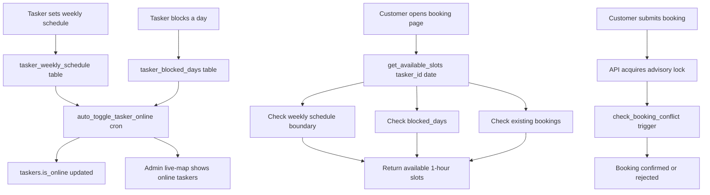

# Tasker Weekly Schedule & Auto Online/Offline System

## Overview

A structured scheduling system where taskers define their weekly availability with precise daily time windows (e.g., Mon-Fri 9AM-6PM). The system automatically toggles tasker online/offline status, customers see only valid slots within schedule boundaries, double-booking is prevented via unique time-slot locking, and a "Block Day" feature handles emergency leave.

---

## Current State Assessment

### What Exists
| Component | Description |
|-----------|-------------|
| [`taskers.availability_hours`](supabase/migrations/013_account_growth.sql:4) | JSONB: `{"mon":["morning"],"tue":["morning","afternoon"],...}` — coarse morning/afternoon/evening buckets |
| [`availability_slots`](supabase/migrations/056_admin_workflows.sql:157) | Normalized table: `(tasker_id, day_of_week, slot)` with morning/afternoon/evening |
| [`check_booking_conflict()`](supabase/migrations/046_phase1_security_data_integrity.sql:21) | DB trigger prevents overlapping bookings on same date |
| [`get_tasker_booked_slots()`](supabase/migrations/060_tasker_acceptance_system.sql:429) | Returns booked (booking_time, hours) for a tasker+date |
| [`taskers.working_days`](supabase/migrations/000_create_schema.sql:37) | `INTEGER[]` — array of day indices |
| [`taskers.working_hours`](supabase/migrations/000_create_schema.sql:38) | JSONB: `{"start":"09:00","end":"18:00"}` — single global range |
| [Booking page](src/app/book/[taskerId]/page.tsx) | Shows 06:00 AM–08:00 PM hourly slots; blocks already-booked slots only |

### Critical Gaps
1. **No `is_online` field** on taskers — no mechanism to toggle auto-online/offline
2. **per-day schedule boundaries are ignored** — booking page shows 6AM-8PM for ALL taskers regardless of their actual working hours
3. **No weekly per-day time windows** — `working_hours` is a single global `{start, end}`, not per-day
4. **No Block Day feature** — no way for a tasker to block an entire day for emergency leave
5. **Realtime online/offline tracking** — admin live-map queries by `last_seen_at` approximation instead of actual online status

---

## Feature Design

### 1. Weekly Schedule Configuration

**Data Model: `tasker_weekly_schedule` table**

```sql
CREATE TABLE tasker_weekly_schedule (
  id UUID PRIMARY KEY DEFAULT gen_random_uuid(),
  tasker_id UUID REFERENCES taskers(id) ON DELETE CASCADE UNIQUE,
  schedule JSONB NOT NULL DEFAULT '{}'::jsonb,
  -- Structure: { "0": {"enabled": true, "start": "09:00", "end": "18:00"},
  --              "1": {"enabled": true, "start": "09:00", "end": "18:00"},
  --              ... "6": {"enabled": false} }
  created_at TIMESTAMPTZ DEFAULT now(),
  updated_at TIMESTAMPTZ DEFAULT now()
);
```

Each day (0=Sunday, 6=Saturday) has:
- `enabled`: boolean — is this a working day?
- `start`: time string (e.g., "09:00") — start of work hours
- `end`: time string (e.g., "18:00") — end of work hours

### 2. Online/Offline Auto-Toggle

**New column on `taskers`:**

```sql
ALTER TABLE taskers ADD COLUMN is_online BOOLEAN DEFAULT false;
```

**Toggle Logic (PostgreSQL function + cron):**

A function `auto_toggle_tasker_online()` runs every 1-2 minutes via pg_cron:

```
1. For each tasker with a weekly schedule:
   a. Determine current day_of_week (Nepal timezone: Asia/Kathmandu)
   b. Check if today is enabled in their schedule
   c. If enabled: check if current time is within [start, end]
   d. If within window AND tasker is active: set is_online = true
   e. If outside window: set is_online = false
2. Also check blocked_days (see below) — if today is blocked, force is_online = false
```

### 3. Block Day Feature

**New table: `tasker_blocked_days`**

```sql
CREATE TABLE tasker_blocked_days (
  id UUID PRIMARY KEY DEFAULT gen_random_uuid(),
  tasker_id UUID REFERENCES taskers(id) ON DELETE CASCADE,
  blocked_date DATE NOT NULL,
  reason TEXT,
  created_at TIMESTAMPTZ DEFAULT now(),
  UNIQUE(tasker_id, blocked_date)
);
```

Rules:
- Tasker can block any future date (not past)
- Blocking today is allowed (takes effect immediately — the auto-toggle cron checks this table)
- A blocked day overrides the schedule entirely (all slots become unavailable)
- Tasker can unblock (delete the row) before the day to re-enable
- Past blocked days auto-clean via a daily cron

### 4. Customer-Facing Slot Display

The booking page will only show slots that satisfy ALL conditions:
1. Time is within tasker's schedule for that day_of_week (start ≤ time < end)
2. Time is not already booked (existing `get_tasker_booked_slots` logic)
3. Day is not blocked (not in `tasker_blocked_days`)
4. Tasker is active (`status = 'active'`)

### 5. Double-Booking Prevention (Slot-Level Locking)

Already partially solved by [`check_booking_conflict()`](supabase/migrations/046_phase1_security_data_integrity.sql:21). Enhancement:

Add a unique constraint or advisory lock approach:
- Before booking insertion, the API acquires a PostgreSQL advisory lock on `(tasker_id, booking_date, booking_time)` to prevent race conditions between concurrent booking attempts
- The existing trigger `trigger_prevent_booking_conflict` serves as the final safety net

---

## Implementation Plan

### Phase 1: Database Schema (Migration 064)

**New Files:** [`supabase/migrations/064_tasker_weekly_schedule.sql`](supabase/migrations/)

1. **Create `tasker_weekly_schedule` table** with RLS policies
2. **Add `is_online BOOLEAN`** to `taskers` table
3. **Create `tasker_blocked_days` table** with RLS policies
4. **Create `auto_toggle_tasker_online()` function**
   - Determines current day/time in Asia/Kathmandu
   - Sets `is_online = true/false` based on schedule
   - Respects blocked_days
5. **Create `get_available_slots(tasker_id, date)` function**
   - Returns array of available time slots (1-hour increments)
   - Filters by: schedule boundary + not blocked + not booked
6. **Create indexes** for performance
7. **Grant permissions**

### Phase 2: Backend API Routes

**New/Modified Files:**
- [`src/app/api/tasker/schedule/route.ts`](src/app/api/) — GET/PUT for tasker's weekly schedule
- [`src/app/api/tasker/block-day/route.ts`](src/app/api/) — POST/DELETE for blocking/unblocking a day
- [`src/app/api/tasker/online-status/route.ts`](src/app/api/) — GET current online status (can also force-refresh)
- Modify [`src/app/api/bookings/create/route.ts`](src/app/api/) — add advisory lock + block-day check

### Phase 3: Frontend — Tasker Schedule Management

**New/Modified Files:**
- New component: [`src/components/tasker/WeeklyScheduleEditor.tsx`](src/components/) — visual weekly grid where tasker sets:
  - Toggle each day ON/OFF
  - Start time selector (hour dropdown: 06:00–22:00)
  - End time selector (hour dropdown: 06:00–22:00)
  - Quick-presets: "Weekdays 9-6", "Weekends 10-4", "All days 8-8"
- New component: [`src/components/tasker/BlockDayButton.tsx`](src/components/) — date picker + reason + confirm
- Modify [`src/app/settings/page.tsx`](src/app/settings/page.tsx) — replace the existing 7-circle availability grid with the new WeeklyScheduleEditor
- Modify [`src/app/tasker/onboard/page.tsx`](src/app/tasker/onboard/page.tsx) — add weekly schedule step during onboarding

### Phase 4: Frontend — Customer Booking Flow

**Modified Files:**
- Modify [`src/app/book/[taskerId]/page.tsx`](src/app/book/[taskerId]/page.tsx):
  - Replace hardcoded `timeSlots` (06:00 AM–08:00 PM) with dynamic slots fetched from `get_available_slots()`
  - Only show slots within the tasker's schedule for that day
  - Disable blocked days in the date picker
  - Show "Tasker unavailable on this day" message for blocked days
  - Show visual indicator of tasker's online/offline status

### Phase 5: Admin Dashboard

**Modified Files:**
- Modify [`src/app/admin/live-map/page.tsx`](src/app/admin/live-map/page.tsx) — use `is_online` instead of `last_seen_at` heuristic
- Add admin ability to view tasker's weekly schedule and blocked days

### Phase 6: Cron Jobs (pg_cron)

1. **`auto_toggle_tasker_online()`** — every 1 minute
2. **`cleanup_past_blocked_days()`** — daily at midnight, deletes blocked_days where `blocked_date < CURRENT_DATE`

---

## Component & Data Flow



---

## Schedule Editor UI Mockup

```
┌─────────────────────────────────────────────────────┐
│  Weekly Schedule                     [Quick Presets] │
│                                                     │
│  ┌──────┬──────┬──────┬──────┬──────┬──────┬──────┐ │
│  │ SUN  │ MON  │ TUE  │ WED  │ THU  │ FRI  │ SAT  │ │
│  │ OFF  │ ON ✓ │ ON ✓ │ ON ✓ │ ON ✓ │ ON ✓ │ OFF  │ │
│  │      │09:00 │09:00 │09:00 │09:00 │09:00 │      │ │
│  │      │18:00 │18:00 │18:00 │18:00 │18:00 │      │ │
│  └──────┴──────┴──────┴──────┴──────┴──────┴──────┘ │
│                                                     │
│  ┌─────────────────────────────────────────────┐    │
│  │  ⚠️  Emergency Leave / Block a Day          │    │
│  │  [Select Date: 2026-05-20 ▼] [Reason: ...] │    │
│  │  [Block This Day]                           │    │
│  └─────────────────────────────────────────────┘    │
│                                                     │
│  Blocked Days: May 18 (Personal), May 22 (Sick)    │
└─────────────────────────────────────────────────────┘
```

---

## Migration from Current System

1. **Backfill `tasker_weekly_schedule`** from existing `availability_hours`:
   - For each tasker with `availability_hours`, convert morning/afternoon/evening slots into the new schedule format:
     - "morning" → start 08:00, end 12:00
     - "afternoon" → start 12:00, end 17:00
     - "evening" → start 17:00, end 21:00
   - Merge contiguous slots (morning+afternoon → 08:00-17:00)

2. **Keep `availability_hours` and `availability_slots`** as legacy — don't break existing `find_available_taskers()` and onboarding flow immediately

3. **New columns are additive** — no destructive changes

---

## Edge Cases & Considerations

| Scenario | Handling |
|----------|----------|
| Tasker changes schedule mid-week | Takes effect on next cron cycle; existing bookings still valid |
| NST (Nepal Standard Time) | All cron functions use `AT TIME ZONE 'Asia/Kathmandu'` |
| DST transitions | Nepal doesn't observe DST — no issue |
| Concurrent bookings for same slot | Advisory lock + `check_booking_conflict()` trigger |
| Tasker blocks today mid-day | Remaining slots become unavailable; existing bookings preserved |
| Tasker schedule with 0 working days | `is_online` always stays `false` |
| Past blocked dates | Daily cleanup cron removes them |
| Booking spans across schedule boundary | Prevented at UI level + validated in API |